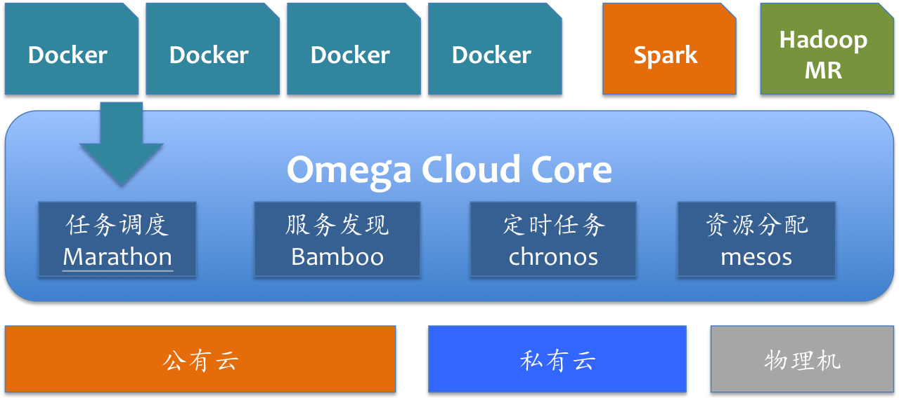

### 试用 Omega Cloud 指南

Omega Cloud是一个高性能的分布式操作系统，目的在云计算环境下向用户提供一个高性能、高可靠和易管理的应用运行环境。它既可以部署在用户租用的公有云上，也可以部署在私有云或者传统物理机上。Omega Cloud 将整个集群服务器的计算和内存资源统一管理，能够让用户像管理一台机器一样管理所有的的服务器，Omega Cloud负责动态调度下层资源，大大简化了管理工作。Omega Cloud 作为一个分布式系统，技术栈主要包括了Mesos和Docker，需要安装如下的组件：

*	Mesos，负责集群运算和存储资源的动态调度
*	Marathon，负责应用的发布和管理
*	Bamboo和HAProxy，负责服务发现
*	Chronos，负责定时任务

#### 公有云部署
试用 Omega Cloud 非常简单。如果您希望在公有云上进行试用，只需要使用我们预先定义好的镜像。Omega Cloud 镜像会陆续上线国内外主要的公有云，例如

* [阿里云试用指南](iaas/aliyun.md)
* [UCloud试用指南](iaas/ucloud.md)

其他公有云正在陆续接入中。如果您有急切需求，请联系我们 <support.oc@dataman-inc.com> 

#### 单机体验版
如果您仅仅想体验一下分布式操作系统，我们为您提供了一个单机“All-in-One”的安装脚本。只需要一台服务器（云主机或者自己的服务器），您可以十分钟内单机部署整套 Omega Cloud，请戳 [单机体验版配置指南](single-node.md)

#### 企业发行版
如果您想学习 Mesos 的原理，自己来手工部署一个集群，也可以尝试一下我们的 [数人科技 Mesos 企业发行版](enterprise-release.md)。这个版本包含了一个以 Mesos 为基础的分布式集群所需全部组件，并且提供国内高速下载源。

#### 管理和发布应用
Omega Cloud 利用内置的 Marathon 来进行应用管理，请阅读 [如何使用 Marathon 来管理 Omega Cloud 中的应用](/get-started/introduction.md)。您也可以阅读翻译的 [Marathon 官方使用文档中文版]()（待完成）。

#### 使用 Docker 来打包应用
如果您想将您的应用发布到 Mesos 集群中，你需要掌握使用 Docker 来封装应用的基本知识。Docker的安装和配置请参考如下资料，目前需求的Docker版本请参照软硬件环境列表。

* [Docker的官方文档（英文）](https://docs.docker.com)
* [Docker —— 从入门到实践”电子书（中文）](http://yeasy.gitbooks.io/docker_practice/content/)

建议熟悉 Docker 的基本使用方法，包括：

* Dockerfile的编写
* Docker网络配置有关知识
* Docker Registry的使用
* 如何自己制作和上传镜像
