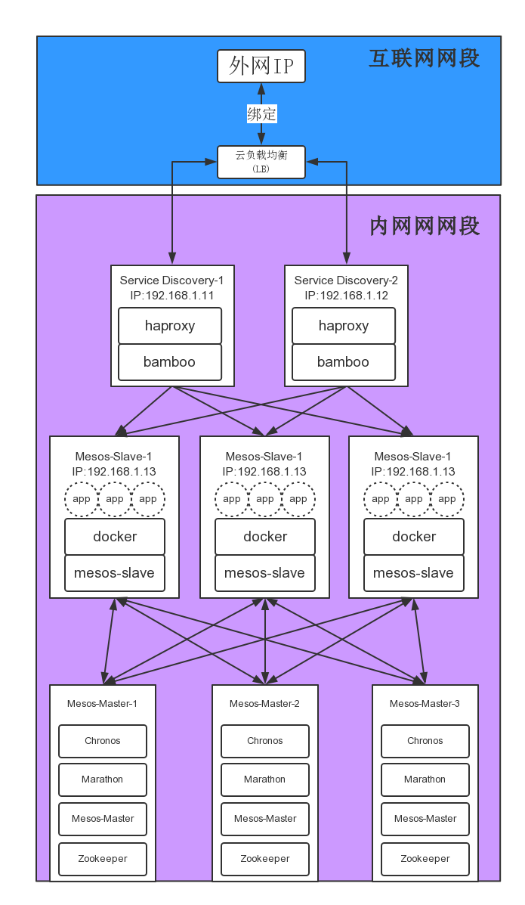

如何在阿里云上使用数人科技 Mesos-based PaaS 解决方案
======================================================

Apache Mesos 作为新兴的统一资源管理与调度平台，其编译，安装，配置还比较繁琐，且鲜有经过生产环境验证的安装包。数人科技对标准版进行定制和二次开发，并部署到用户的生产环境中。你可以参考该用户手册，快速搭建一套数人科技的 **Mesos/Marathon/Bamboo/Chronos** 环境。

*Note: 更多配置信息请访问[数人科技开源服务](http://get.dataman.io)*

##集群架构图



1. mesos-master-*: 部署了zookeeper, ，Mesos-Master，Marathon 以及 Chronos
2. mesos-slave-*: 部署了mesos-slave agent
3. Service-Discovery-*: 部署了bamboo来做服务发现


##先决条件

1. 用户需要为集群启动的每一个host绑定IP地址，并保证这些host之间可以通过IP直接通信。为了保证通信质量，我们建议您在云上设置**子网**并将集群中的host放到同一个子网内。
2. 为了能在公网上使用mesos/marathon/bamboo的web服务，你的集群需要一个公网IP作为入口，通过配置**跳板机**和**浏览器代理**（譬如： **ssh tunnel**）的方式可以达到这个目的。

##快速启动Mesos Master, Marathon 和 Chronos

依据数人科技在生产环境上的实践经验，我们可以将zookeeper，Mesos-Master，Marathon 以及 Chronos 部署在一起，建议配置为``3个host X 2核4G``。下面是详细的部署过程。

1. 可以直接创建ECS云主机，也可以先申请VPC专有网络后再创建云主机。因为集群所有节点都应该部署在相同的子网内，所以建议新建一个子网。

2. 我们要创建 3 台云主机，作为 3 个互为热备的 Master 节点，所以以下步骤请执行 3 遍。
首先在镜像市场中选择镜像。如果作为测试和体验目的，主机的配置可以随意选择。

  **Ubuntu 14.04 64位**

    选择*镜像市场*里的**DataMan-Mesos-Master-0220-on-Ubuntu-14-64**（数人科技Ubuntu企业版）

  **CentOS 7 64位**
  
     选择*镜像市场*里的**DataMan-Mesos-Master-0220-on-CentOS-7-64**（数人科技CentOS企业版）


请注意，以上流程请执行三次，建立三个互为热备的Master节点。随后请继续启动Master节点上的相应服务。

3.配置并启动 zookeeper

  *   Ubuntu 14.04 64位

 在3台主机``1, 2, 3``上分别执行下面命令
 
    ```bash
    # 分别设置3台主机的 MYID 为 1，2 或 3
    root@localhost:~$export MYID=< 1 or 2 or 3 >
    # 分别设置环境变量 ZK1, ZK2 和 ZK3 为3台主机的ip地址
    root@localhost:~$export ZK1=< zookeeper IP1 >
    root@localhost:~$export ZK2=< zookeeper IP2 >
    root@localhost:~$export ZK3=< zookeeper IP3 >
    root@localhost:~$echo $MYID > /var/lib/zookeeper/myid
    root@localhost:~$cat << EOF >>/etc/zookeeper/conf/zoo.cfg
    >server.1=$ZK1:2888:3888
    >server.2=$ZK2:2888:3888
    >server.3=$ZK3:2888:3888
    >EOF
    ```

  * CentOS 7 64位

  在3台主机``1, 2, 3``上分别执行下面命令
 
    ```bash
    # 分别设置3台主机的 MYID 为 1，2 或 3
    root@localhost:~$export MYID=< 1 or 2 or 3 >
    # 分别设置环境变量 ZK1, ZK2 和 ZK3 为3台主机的ip地址
    root@localhost:~$export ZK1=< zookeeper IP1 >
    root@localhost:~$export ZK2=< zookeeper IP2 >
    root@localhost:~$export ZK3=< zookeeper IP3 >
    root@localhost:~$echo $MYID > /var/lib/zookeeper/myid
    root@localhost:~$cp /usr/share/zookeeper/conf/zoo_sample.cfg /usr/share/zookeeper/conf/zoo.cfg
    root@localhost:~$sed -i "/dataDir=/c dataDir=/var/lib/zookeeper" /usr/share/zookeeper/conf/zoo.cfg
    root@localhost:~$cat << EOF >>/etc/zookeeper/conf/zoo.cfg
    >server.1=$ZK1:2888:3888
    >server.2=$ZK2:2888:3888
    >server.3=$ZK3:2888:3888
    >EOF
    ```

  在``1, 2, 3``上启动服务

    ```bash
    root@localhost:~$/usr/share/zookeeper/bin/zkServer.sh start
    ```

4.配置Mesos Master

  在3台主机``1, 2, 3``上分别执行下面命令
  
    ```bash
    # 分别设置环境变量 ZK1, ZK2 和 ZK3 为3台主机的ip地址
    root@localhost:~$export ZK1=< zookeeper IP1 >
    root@localhost:~$export ZK2=< zookeeper IP2 >
    root@localhost:~$export ZK3=< zookeeper IP3 >
    root@localhost:~$echo "zk://$ZK1:2181,$ZK2:2181,$ZK3:2181/mesos" > /etc/mesos/zk
    root@localhost:~$echo 2 > /etc/mesos-master/quorum
    root@localhost:~$echo `hostname -I` > /etc/mesos-master/ip
    root@localhost:~$echo `hostname -I` > /etc/mesos-master/hostname
    root@localhost:~$echo "DataMan" > /etc/mesos-master/cluster
    ```
 
  启动服务
  
  * Ubuntu 14.04 64位
 
    ```bash
    root@localhost:~$start mesos-master
    ```
 
  * CentOS 7 64位
 
    ```bash
    root@localhost:~$service mesos-master restart
    ```

5.配置Marathon

  在3台主机``1, 2, 3``上分别执行下面命令

    ```bash
    root@localhost:~$mkdir -p  /etc/marathon/conf
    root@localhost:~$cd /etc/marathon/conf/
    # 分别设置环境变量 ZK1, ZK2 和 ZK3 为3台主机的ip地址
    root@localhost:~$export ZK1=< zookeeper IP1 >
    root@localhost:~$export ZK2=< zookeeper IP2 >
    root@localhost:~$export ZK3=< zookeeper IP3 >
    root@localhost:~$echo "zk://$ZK1:2181,$ZK2:2181,$ZK3:2181/marathon" > zk
    root@localhost:~$echo `hostname -I` > hostname
    root@localhost:~$echo "zk://$ZK1:2181,$ZK2:2181,$ZK3:2181/mesos" > master
    ```
 
  启动服务
  
  * Ubuntu 14.04 64位
 
    ```bash
    root@localhost:~$start marathon
    ```
 
  * CentOS 7 64位
 
    ```bash
    root@localhost:~$service marathon restart
    ```


6.配置Chronos


  在3台主机``1, 2, 3``上分别执行下面命令启动服务
  
  * Ubuntu 14.04 64位
 
    ```bash
    root@localhost:~$start chronos
    ```
 
  * CentOS 7 64位
 
    ```bash
    root@localhost:~$service chronos restart
    ```

 *Note: 更多参数请访问[数人科技开源服务](http://get.dataman.io)*


##快速启动Mesos Slave

基于不同的应用场景，Mesos Slave节点无论是数量还是配置都会有不同的需求。Slave节点的数量是可弹性增加的，所以我们建议初期用户可以启动2-6台``2核4G``的云主机试用（这里以3台为例）；生产环境建议``4核8G``或更高，节点数量按需增加即可。

*Note：我们后期会有集群节点梯度配置优化的相关分享*

1. 创建主机，主要注意事项请参照建立Master节点。

  * Ubuntu 14.04 64位

    选择*行业*镜像里的**DataMan-Mesos-Slave-0220-on-Ubuntu-14-64** （Mesos Slave数人科技企业版）

  * CentOS 7 64位
  
     选择*行业*镜像里的**DataMan-Mesos-Slave-0220-on-CentOS-7-64**（Mesos Slave数人科技企业版）

2. 登陆主机，执行如下命令来配置Mesos Slave（以3台为例）

  ```bash
  # 分别设置环境变量 ZK1, ZK2 和 ZK3 为3台主机的ip地址
  root@localhost:~$ export $ZK1=< zookeeper IP1 >
  root@localhost:~$ export $ZK2=< zookeeper IP2 >
  root@localhost:~$ export $ZK3=< zookeeper IP3 >
  root@localhost:~$ echo "docker,mesos" > /etc/mesos-slave/containerizers
  root@localhost:~$ echo "cgroups/cpu,cgroups/mem" > /etc/mesos-slave/isolation
  root@localhost:~$ echo `hostname -I` > /etc/mesos-slave/ip
  root@localhost:~$ echo `hostname` > /etc/mesos-slave/hostname
  root@localhost:~$ echo "zk://$ZK1:2181,$ZK2:2181,$ZK3:2181/mesos" > /etc/mesos/zk
  root@localhost:~$ restart mesos-slave
  ```
  *Note: 更多参数请访问[数人科技开源服务](http://get.dataman.io)*


##快速启动Bamboo

1. 创建主机，请参考 Master 节点的安装流程。

  * Ubuntu 14.04 64位

    选择*行业*镜像里的**DataMan-Bamboo-090-on-Ubuntu-14-64** （Bamboo数人科技Ubuntu企业版）

  * CentOS 7 64位
  
     选择*行业*镜像里的**DataMan-Bamboo-090-on-CentOS-7-64** （Bamboo数人科技CentOS企业版）

  Bamboo 云主机建议配置为``2核4G``，另外，由于Bamboo host是集群服务发现的总出口，该点存在网络压力，需要在生产环境应用负载均衡等手段进行优化。

2. 登陆主机，按如下参数配置

  ```bash
  root@localhost:~$ /opt/bamboo/bamboo -config_from_flags -haproxy_check -bamboo_endpoint="http://localhost:8000" -bamboo_zk_host="<zookeeper IP1>:2181,<zookeeper IP2>:2181,<zookeeper IP3>:2181" -marathon_endpoint="http://<Marathon IP>:8080"
  ```
  *Note: 更多参数请访问[在linux上安装Bamboo数人科技企业版](http://get.dataman.io/#bamboo)*


##docker 仓库（可选）

  我们经常需要在Marathon上使用docker container，这时候使用 Docker Hub 这样的公共仓库可能不方便。数人科技提供的解决方案有如下两个。

###方案一：使用国内的 docker 镜像加速器

  目前国内很多厂商提供 docker 加速服务， 譬如可以参考[daocloud 的 docker 加速服务](http://get.daocloud.io/)，为你的**Mesos集群**配置镜像加速器。

###方案二：搭建私有仓库

  我们也可以创建一个本地仓库供集群使用，这里建议参考dockerpool的文章[搭建私有仓库](http://dockerpool.com/static/books/docker_practice/repository/local_repo.html)来搭建私有仓库。 同时，可以结合方案一的加速服务来快速拉取公有镜像到内部仓库。
  
  另外，在使用 UCloud 云主机搭建私有仓库时，请提前做好规划，譬如网络带宽，以及申请足够大的数据盘来为本地仓库预留充足的存储空间等。

##镜像描述

  数人科技通过UCloud的镜像仓库为用户提供了如下的镜像。

###DataMan-Mesos-Master-0220-on-CentOS-7-64

  基于基础镜像CentOS-7-64bit预装了Mesos-0.22.0, Marathon-0.8.1, Chronos-2.3.3和zookeeper并做了一些配置优化。使用该镜像，你只需要进行简单配置就可以得到一组生产环境的mesos master节点。

###DataMan-Mesos-Master-0221-on-Ubuntu-14-64

  基于基础镜像ubuntu-14.04-64bit预装了Mesos-0.22.1, Marathon-0.8.1, Chronos-2.3.3和zookeeper并做了一些配置优化。使用该镜像，你只需要进行简单配置就可以得到一组生产环境的mesos master节点。

###DataMan-Mesos-Slave-0220-on-CentOS-7-64

  基于基础镜像CentOS-7-64bit预装了Mesos-0.22.0和docker-1.6并做了一些配置优化。使用该镜像，你只需要进行简单配置就可以得到一个生产环境的mesos slave节点。

###DataMan-Mesos-Slave-0221-on-Ubuntu-14-64

  基于基础镜像ubuntu-14.04-64bit预装了Mesos-0.22.1并做了一些配置优化。使用该镜像，你只需要进行简单配置就可以得到一个生产环境的mesos slave节点。

###DataMan-Bamboo-090-on-CentOS-7-64

  基于基础镜像CentOS-7-64bit预装了数人科技release的[bamboo-0.9.0](https://github.com/Dataman-Cloud/bamboo/releases/tag/dr-0.9.0)。bamboo通过动态配置HAproxy为mesos集群做**外部服务发现**，使用该镜像，你可以快速打通外部用户到内网应用的通道。

###DataMan-Bamboo-090-on-Ubuntu-14-64

  基于基础镜像ubuntu-14.04-64bit预装了数人科技release的[bamboo-0.9.0](https://github.com/Dataman-Cloud/bamboo/releases/tag/dr-0.9.0)。bamboo通过动态配置HAproxy为mesos集群做**外部服务发现**，使用该镜像，你可以快速打通外部用户到内网应用的通道。


##联系我们

  [数人科技团队](http://www.dataman-inc.com/contact.html)

  
