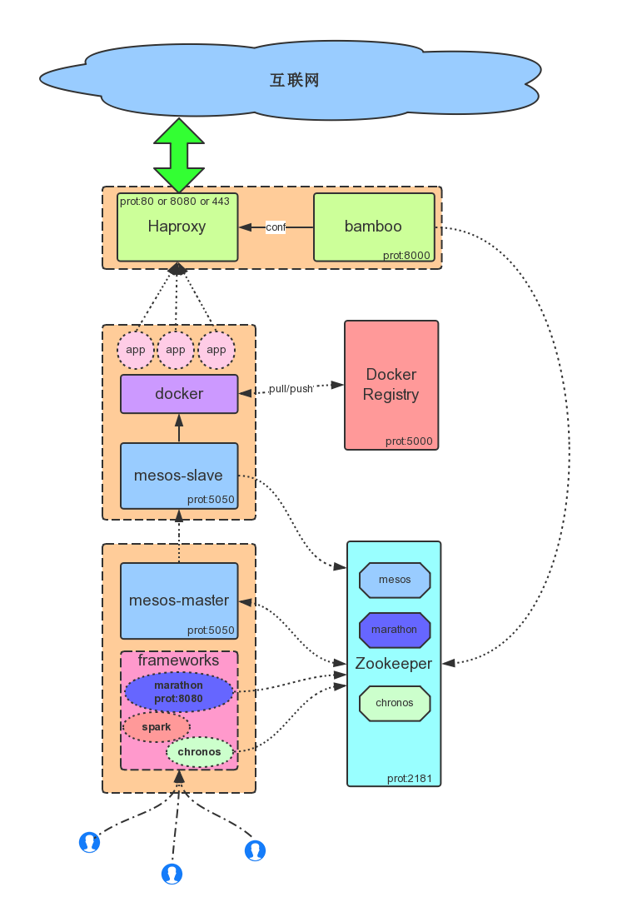

# 数人科技Mini(单机版)-Mesos系统安装-Ubuntu
    文档信息
    创建人 庞铮
    邮件地址 zpang@dataman-inc.com
    建立时间 2015年6月28号
    更新时间 2015年7月1号

## 单机Mesos环境部署
### 单机环境说明
由于大多数初学者并没有集群环境，为了叫更多的人了解Mesos系统的魅力，本人将整套Mesos上部署在单机环境中，并记录下来给大家贡献。本环境适合初学者对于Mesos系统环境了解学习。

因为是初级环境，所以本环境中只包括了Mesos自身系统和调度框架中最基础的一种---Marathon。以及因为是单机所以没有部署Docker私有仓库。

### 应用部署拓扑图

### 拓扑图说明
整体系统部署分5个部分:

* 任务调度层

    包括:Mesos-Master和Frameworks(调度框架)
    
    功能:资源和任务调度节点

* 任务执行层

    包括:Mesos-Slave和Docker
    
    功能:任务执行节点

* 镜像存储

    包括:DockerRegistry
    
    功能:环境存储节点

* 数据交互层

    包括:Zookeeper

    功能:集群状态、任务相关数据信息存储节点

* 网络层
    
    包括:Haproxy和Bamboo
    
    功能:网络层服务发现节点

### 部署环境需求

* Ubuntu 14.04LTS/64位以上版本
* 硬件2核4g内存
* root权限
* 外网可用
* dns 推荐 114.114.114.114(防止dns劫持，你懂的)

### 安装部署
 
#### 安装Docker

```bash
    if [ ! -e /usr/lib/apt/methods/https ]; then
        sudo apt-get update && sudo apt-get install -y apt-transport-https
    else
        echo "$datetime HTTPS transport is available"
    fi
    # Add the repository to your APT sources
    echo deb https://get.docker.com/ubuntu docker main > /etc/apt/sources.list.d/docker.list
    # Then import the repository key
    apt-key adv --keyserver hkp://p80.pool.sks-keyservers.net:80 --recv-keys 36A1D7869245C8950F966E92D8576A8BA88D21E9
    # Install docker
    sudo apt-get update && sudo apt-get install -y lxc-docker
```

#### 安装 Zookeeper

```bash
    sudo apt-key adv --keyserver keyserver.ubuntu.com --recv E56151BF
    DISTRO=$(lsb_release -is | tr '[:upper:]' '[:lower:]')
    CODENAME=$(lsb_release -cs)
    # Add the repository
    echo "deb http://repos.mesosphere.io/${DISTRO} ${CODENAME} main" |
    sudo tee /etc/apt/sources.list.d/mesosphere.list
    # Install packages
    sudo apt-get update && apt-get -y install zookeeper zookeeper-bin zookeeperd
```

#### 安装 Mesos

```bash
    sudo wget -O - http://get.dataman.io/repos/ubuntu/key | sudo apt-key add -
    sudo echo "deb http://get.dataman.io/repos/ubuntu ./" > /etc/apt/sources.list.d/dataman.list
    # Install dataman mesos
    sudo apt-get update && sudo apt-get -y install mesos
```

#### 安装 Marathon

```bash
    sudo wget -O - http://get.dataman.io/repos/ubuntu/key | sudo apt-key add -
    sudo echo "deb http://get.dataman.io/repos/ubuntu ./" > /etc/apt/sources.list.d/dataman.list
    # Install dataman marathon
    sudo apt-get update && sudo apt-get -y install marathon
```

#### 安装 Haproxy

```bash
    HAPROXY_EXE=`which haproxy`
    if [ -z "$HAPROXY_EXE" ]; then
        #Install HAProxy
        sudo apt-add-repository -y ppa:vbernat/haproxy-1.5 && sudo apt-get update && sudo apt-get install -y haproxy
    fi
```

#### Log设置

```bash
    sudo /bin/cat > /etc/rsyslog.d/dataman.haproxy.conf<<EOF
    $ModLoad imudp
    $UDPServerRun 514
    $UDPServerAddress 127.0.0.1
    EOF
```

#### 安装Bamboo

```bash
    VERSION=0.9.0
    P_NAME=dataman-bamboo-$VERSION.tar.gz
    BAMBOO_INSTALL_HOME=/opt/bamboo
    BAMBOO_HOME=/usr/local/bamboo
    #net
    if [ -d "$BAMBOO_HOME" ];then
        /bin/rm -Rf $BAMBOO_HOME
    fi
    if [ -f "$P_NAME" ];then
        /bin/rm -Rf $P_NAME
    fi
    sudo /usr/bin/wget https://github.com/Dataman-Cloud/bamboo/releases/download/dr-$VERSION/$P_NAME && sudo /bin/mkdir $BAMBOO_INSTALL_HOME && sudo /bin/tar xzvf $P_NAME -C $BAMBOO_INSTALL_HOME --strip-components=1 && sudo /bin/rm -f $P_NAME* && sudo /bin/chmod -R 775 $BAMBOO_INSTALL_HOME &&  sudo /bin/ln -s $BAMBOO_INSTALL_HOME $BAMBOO_HOME 
```

### 配置说明
#### Mesos-Master

配置 Mesos 本身信息

```bash
    #配置mesos在zk的使用目录
    echo "zk://localhost:2181/mesos" > "/etc/mesos/zk"
```

配置 Mesos-Master 相关信息

```bash
    #指定master配置目录
    MESOS_MASTER_CONF_DIR="/etc/mesos-master"
    #指定master的主机名
    echo "localhost" > $MESOS_MASTER_CONF_DIR/hostname
    #指定master的ip
    echo "0.0.0.0" > $MESOS_MASTER_CONF_DIR/ip
    #副本的仲裁数量的大小（集群配置很重要，本次试验只有1台所以写1）
    echo "1" > $MESOS_MASTER_CONF_DIR/quorum
    #注册表中存储持久性信息的地址
    echo "/var/lib/mesos" > $MESOS_MASTER_CONF_DIR/work_dir
```

#### Mesos-Slave

配置 Mesos-Slave 相关信息

```bash
    #指定slave配置目录
    MESOS_SLAVE_CONF_DIR="/etc/mesos-slave"
    #指定slave的主机名(这里不能用localhost)
    echo "10.3.1.3" > $MESOS_SLAVE_CONF_DIR/hostname
    #指定slave支持的容器类型
    echo "docker,mesos" > $MESOS_SLAVE_CONF_DIR/containerizers
    #指定slave的ip
    echo "0.0.0.0" > $MESOS_SLAVE_CONF_DIR/ip
    #执行器注册超时时间
    echo "5mins" > $MESOS_SLAVE_CONF_DIR/executor_registration_timeout
    #指定mesos资源控制的内容(这里只有打开对CPU和内存的控制)
    echo "cgroups/cpu,cgroups/mem" > $MESOS_SLAVE_CONF_DIR/isolation
```

#### MARATHON

配置Marathon相关信息

```bash
    #创建配置文件目录
    mkdir /etc/marathon/conf
    #指定marathon配置目录
    MARATHON_CONF_DIR="/etc/marathon/conf"
    #指定marathon在zk目录路径
    echo "zk://127.0.0.1:2181/marathon" > $MARATHON_CONF_DIR/zk
    #事件订阅模式
    echo "http_callback" > $MARATHON_CONF_DIR/event_subscriber
    #指定marathon主机名
    echo "127.0.0.1" > $MARATHON_CONF_DIR/hostname
    #指定mesos在zk目录路径
    echo "zk://127.0.0.1:2181/mesos" > $MARATHON_CONF_DIR/master
```

#### BAMBOO

##### 注释 ha 模版的8080部分，否则该8080端口和 marathon 自带默认端口冲突

```bash
    vim /opt/bamboo/config/haproxy_template.cfg
    
    #注释掉一下模版
    frontend websocket-in
        bind *:8080
        {{ $services := .Services }}
        {{ range $index, $app := .Apps }} {{ if $app.Env.BAMBOO_WEBSOCKET_OPEN }} {{ if hasKey $services $app.Id }} {{ $service := getService $services $app.Id }}
        acl {{ $app.EscapedId }}-websocket-aclrule {{ $service.Acl}}:8080
        use_backend {{ $app.EscapedId }}-websocket-cluster if {{ $app.EscapedId }}-websocket-aclrule
        {{ end }} {{ end }} {{ end }}

        stats enable
        # CHANGE: Your stats credentials
        stats auth admin:admin
        stats uri /haproxy_stats

    {{ range $index, $app := .Apps }} {{ if $app.Env.BAMBOO_WEBSOCKET_OPEN }}
    backend {{ $app.EscapedId }}-websocket-cluster{{ if $app.HealthCheckPath }}
        option httpchk GET {{ $app.HealthCheckPath }}
        {{ end }}
        balance leastconn
        option httpclose
        option forwardfor
        {{ range $page, $task := .Tasks }}
        server {{ $app.EscapedId }}-{{ $task.Host }}-{{ index $task.Ports 1 }} {{ $task.Host }}:{{ index     $task.Ports 1 }} {{ end }}
    {{ end }}
    {{ end }}
```
    
##### 修改 bamboo 配置

```bash
    sudo /bin/cat > /opt/bamboo/config/production.json<<EOF
    {
      "Marathon": {
    "Endpoint": "http://127.0.0.1:8080"
      },

      "Bamboo": {
    "Endpoint": "http://127.0.0.1:8000",
    "Zookeeper": {
      "Host": "127.0.0.1:2181",
      "Path": "/marathon-haproxy/state",
      "ReportingDelay": 5
    }
      },

      "HAProxy": {
    "TemplatePath": "/opt/bamboo/config/haproxy_template.cfg",
    "OutputPath": "/etc/haproxy/haproxy.cfg",
    "ReloadCommand": "PIDS=`pidof haproxy`; haproxy -f /etc/haproxy/haproxy.cfg -p /var/run/haproxy.pid -sf $PIDS && while ps -p $PIDS; do sleep 0.2; done"
      },

      "StatsD": {
    "Enabled": false,
    "Host": "localhost:8125",
    "Prefix": "bamboo-server.development."
      }
    }
    EOF
```

bamboo-json配置文件基础说明:

- http://127.0.0.1:8080 ＃Marathon地址 
- http://127.0.0.1:8000 ＃Bamboo地址
- 127.0.0.1:2181 #zookeeper地址
- /opt/bamboo/config/haproxy_template.cfg ＃bamboo自带haproxy配置文件模版路径
- /etc/haproxy/haproxy.cfg ＃haproxy配置文件路径
- localhost:8125 ＃StatsD监控地址(需要另行安装)

### 服务操作（启动、关闭、重启、状态）
#### Mesos-master

```bash
    #命令
    service mesos-master (status｜start｜stop|restart) 
    #进程状态
    ps axuf | grep mesos-master | grep -v grep
    root      4343  0.0  0.4 1210808 18460 ?       Ssl  13:32   0:00 /usr/sbin/mesos-master --zk=zk://localhost:2181/mesos --port=5050 --log_dir=/var/log/mesos --hostname=10.3.1.2 --ip=0.0.0.0 --quorum=1 --work_dir=/var/lib/mesos
    root      4366  0.0  0.0   5908   608 ?        S    13:32   0:00  \_ logger -p user.info -t mesos-master[4343]
    root      4367  0.0  0.0   5908   704 ?        S    13:32   0:00  \_ logger -p user.err -t mesos-master[4343]
```

#### Mesos-slave

```bash
    #命令
    service mesos-slave (status｜start｜stop|restart)
    #进程状态
    ps axuf | grep mesos-slave | grep -v grep
    root      4368  0.1  0.3 890764 15316 ?        Ssl  13:32   0:01 /usr/sbin/mesos-slave --master=zk://localhost:2181/mesos --log_dir=/var/log/mesos --containerizers=docker,mesos --executor_registration_timeout=5mins --hostname=10.3.1.2 --ip=0.0.0.0 --isolation=cgroups/cpu,cgroups/mem
    root      4405  0.0  0.0   5908   608 ?        S    13:32   0:00  \_ logger -p user.info -t mesos-slave[4368]
    root      4406  0.0  0.0   5908   704 ?        S    13:32   0:00  \_ logger -p user.err -t mesos-slave[4368]
#### 3.7.3 Marathon
    #命令
    service marathon (status｜start｜stop|restart)
    #进程状态
    ps axuf | grep marathon | grep -v grep
    root      4515  2.8  6.2 2082080 254804 ?      Ssl  13:32   0:23 java -Djava.library.path=/usr/local/lib:/usr/lib:/usr/lib64 -Djava.util.logging.SimpleFormatter.format=%2$s%5$s%6$s%n -Xmx512m -cp /usr/bin/marathon mesosphere.marathon.Main --hostname 127.0.0.1 --event_subscriber http_callback --zk zk://127.0.0.1:2181/marathon --master zk://127.0.0.1:2181/mesos
    root      4543  0.0  0.0   5908   708 ?        S    13:32   0:00  \_ logger -p user.info -t marathon[4515]
    root      4544  0.0  0.0   5908   708 ?        S    13:32   0:00  \_ logger -p user.notice -t marathon[4515]
```

#### Haproxy

```bash
    #命令
    service haproxy (status｜start｜stop|restart)
    #进程状态
    ps axuf | grep haproxy | grep -v grep
    haproxy   4903  0.0  0.0  29156  1012 ?        Ss   13:42   0:00 haproxy -f /etc/haproxy/haproxy.cfg -p /var/run/haproxy.pid -sf 4882
```

#### Bamboo

```bash
    #启动命令
    /opt/bamboo/bamboo -config /usr/local/bamboo/config/production.json -log /var/log/bamboo-server.log
    ＃进程状态
    ps axuf | grep bamboo | grep -v grep
    root      4721  0.0  0.2 200920 10204 ?        Sl   13:32   0:00 /opt/bamboo/bamboo -config /usr/local/bamboo/config/production.json -log /var/log/bamboo-server.log
```

#### Zookeeper

```bash
    #启动命令
    service zookeeper (status｜start｜stop|restart)
    ＃进程状态
    ps axuf | grep zookeeper | grep -v grep
    zookeep+  8264  0.0  2.2 2370896 89868 ?       Ssl  Jun29   1:26 /usr/bin/java -cp /etc/zookeeper/conf:/usr/share/java/jline.jar:/usr/share/java/log4j-1.2.jar:/usr/share/java/xercesImpl.jar:/usr/share/java/xmlParserAPIs.jar:/usr/share/java/netty.jar:/usr/share/java/slf4j-api.jar:/usr/share/java/slf4j-log4j12.jar:/usr/share/java/zookeeper.jar -Dcom.sun.management.jmxremote -Dcom.sun.management.jmxremote.local.only=false -Dzookeeper.log.dir=/var/log/zookeeper -Dzookeeper.root.logger=INFO,ROLLINGFILE org.apache.zookeeper.server.quorum.QuorumPeerMain /etc/zookeeper/conf/zoo.cfg
```
