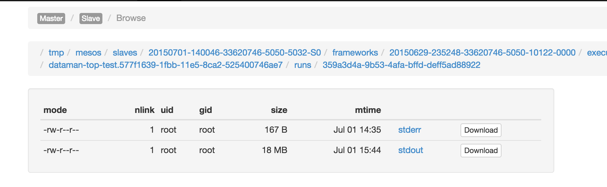
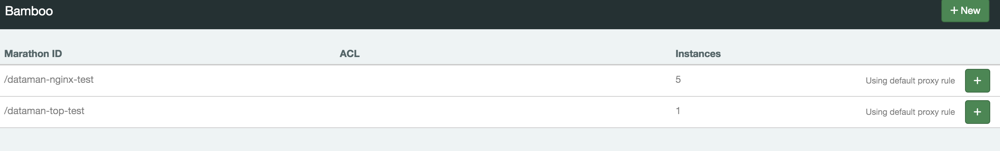
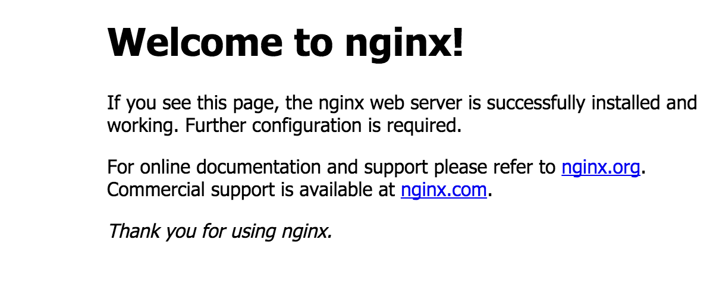

# 数人科技Mini(单机版)-Mesos系统安装-Ubuntu
    文档信息
    创建人 庞铮
    邮件地址 zpang@dataman-inc.com
    建立时间 2015年6月28号
    更新时间 2015年7月1号
## 1 系统说明
### 1.1 什么是Mesos
Apache Mesos是由加州大学伯克利分校的AMPLab首先开发的一款开源群集管理软件，支持Hadoop、ElasticSearch、Spark、Storm 和Kafka等应用架构。
### 1.2 Mesos特性
- 可扩展到10000个节点
- 使用ZooKeeper实现Master和Slave的容错
- 支持Docker容器
- 使用Linux容器实现本地任务隔离
- 基于多资源（内存，CPU、磁盘、端口）调度
- 提供Java，Python，C++等多种语言 APIs
- 通过Web界面查看集群状态
- 新版本将支持更多

## 2 架构说明
### 2.1 Mesos架构图

### 2.2 说明
* Mesos本身包含两个组件:Master Daemon和Slave Daemon。
    * Master Daemon
        * 管理所有的Slave Daemon。
        * 用Resource Offers实现跨应用细粒度资源共享，如cpu、内存、磁盘、网络等。
        * 限制和提供资源给应用框架使用。
        * 使用可拔插的模块化的架构，方便增加新的策略控制机制。
    * Slave Daemon
        * 负责接收和管理Master发来的需求Task
        * 支持使用各种环境运行各种Task，如Docker、VM、进程调度(纯硬件)。
        
* Mesos上的task由2个组件管理:调度器(Scheduler)和执行进程(Executor Process)
    * 调度器(Scheduler)
        * 调度器通过注册Mesos Master获得集群资源调度权限
        * 调度器可通过MesosSchedule Driver接口和Mesos Master交互
    * 执行进程(Executor Process)
        * 用于启动框架内部的task
        * 不同的调度器使用不同的Executor

* Mesos集群为了避免单点故障，所以使用Zookeeper进行集群交互。

## 3 单机Mesos环境部署
### 3.1 单机环境说明
由于大多数初学者并没有集群环境，为了叫更多的人了解Mesos系统的魅力，本人将整套Mesos上部署在单机环境中，并记录下来给大家贡献。本环境适合初学者对于Mesos系统环境了解学习。

因为是初级环境，所以本环境中只包括了Mesos自身系统和调度框架中最基础的一种---Marathon。以及因为是单机所以没有部署Docker私有仓库。
### 3.2 应用部署拓扑图

### 3.3 拓扑图说明
整体系统部署分5个部分:

* 任务调度层

    包括:Mesos-Master和Frameworks(调度框架)
    
    功能:资源和任务调度节点

* 任务执行层

    包括:Mesos-Slave和Docker
    
    功能:任务执行节点

* 镜像存储

    包括:DockerRegistry
    
    功能:环境存储节点

* 数据交互层

    包括:Zookeeper

    功能:集群状态、任务相关数据信息存储节点

* 网络层
    
    包括:Haproxy和Bamboo
    
    功能:网络层服务发现节点

### 3.4 部署环境需求
* Ubuntu 14.04LTS/64位以上版本
* 硬件2核4g内存
* root权限
* 外网可用
* dns 推荐 114.114.114.114(防止dns劫持，你懂的)

### 3.5安装部署
 
#### 3.5.1 安装Docker
    if [ ! -e /usr/lib/apt/methods/https ]; then
        sudo apt-get update && sudo apt-get install -y apt-transport-https
    else
        echo "$datetime HTTPS transport is available"
    fi
    # Add the repository to your APT sources
    echo deb https://get.docker.com/ubuntu docker main > /etc/apt/sources.list.d/docker.list
    # Then import the repository key
    apt-key adv --keyserver hkp://p80.pool.sks-keyservers.net:80 --recv-keys 36A1D7869245C8950F966E92D8576A8BA88D21E9
    # Install docker
    sudo apt-get update && sudo apt-get install -y lxc-docker
#### 3.5.2 安装Zookeeper
    sudo apt-key adv --keyserver keyserver.ubuntu.com --recv E56151BF
    DISTRO=$(lsb_release -is | tr '[:upper:]' '[:lower:]')
    CODENAME=$(lsb_release -cs)
    # Add the repository
    echo "deb http://repos.mesosphere.io/${DISTRO} ${CODENAME} main" |
    sudo tee /etc/apt/sources.list.d/mesosphere.list
    # Install packages
    sudo apt-get update && apt-get -y install zookeeper zookeeper-bin zookeeperd
#### 3.5.3 安装Mesos
    sudo wget -O - http://get.dataman.io/repos/ubuntu/key | sudo apt-key add -
    sudo echo "deb http://get.dataman.io/repos/ubuntu ./" > /etc/apt/sources.list.d/dataman.list
    # Install dataman mesos
    sudo apt-get update && sudo apt-get -y install mesos    
#### 3.5.4 安装Marathon
    sudo wget -O - http://get.dataman.io/repos/ubuntu/key | sudo apt-key add -
    sudo echo "deb http://get.dataman.io/repos/ubuntu ./" > /etc/apt/sources.list.d/dataman.list
    # Install dataman marathon
    sudo apt-get update && sudo apt-get -y install marathon
#### 3.5.5 安装Haproxy
    HAPROXY_EXE=`which haproxy`
    if [ -z "$HAPROXY_EXE" ]; then
        #Install HAProxy
        sudo apt-add-repository -y ppa:vbernat/haproxy-1.5 && sudo apt-get update && sudo apt-get install -y haproxy
    fi
#### 3.5.6 Log设置
    sudo /bin/cat > /etc/rsyslog.d/dataman.haproxy.conf<<EOF
    $ModLoad imudp
    $UDPServerRun 514
    $UDPServerAddress 127.0.0.1
    EOF
#### 3.5.7 安装Bamboo
    VERSION=0.9.0
    P_NAME=dataman-bamboo-$VERSION.tar.gz
    BAMBOO_INSTALL_HOME=/opt/bamboo
    BAMBOO_HOME=/usr/local/bamboo
    #net
    if [ -d "$BAMBOO_HOME" ];then
        /bin/rm -Rf $BAMBOO_HOME
    fi
    if [ -f "$P_NAME" ];then
        /bin/rm -Rf $P_NAME
    fi
    sudo /usr/bin/wget https://github.com/Dataman-Cloud/bamboo/releases/download/dr-$VERSION/$P_NAME && sudo /bin/mkdir $BAMBOO_INSTALL_HOME && sudo /bin/tar xzvf $P_NAME -C $BAMBOO_INSTALL_HOME --strip-components=1 && sudo /bin/rm -f $P_NAME* && sudo /bin/chmod -R 775 $BAMBOO_INSTALL_HOME &&  sudo /bin/ln -s $BAMBOO_INSTALL_HOME $BAMBOO_HOME 
### 3.6 配置说明
#### 3.6.1 Mesos-Master
配置Mesos本身信息
    
    #配置mesos在zk的使用目录
    echo "zk://localhost:2181/mesos" > "/etc/mesos/zk"

配置Mesos-Master相关信息

    #指定master配置目录
    MESOS_MASTER_CONF_DIR="/etc/mesos-master"
    #指定master的主机名
    echo "localhost" > $MESOS_MASTER_CONF_DIR/hostname
    #指定master的ip
    echo "0.0.0.0" > $MESOS_MASTER_CONF_DIR/ip
    #副本的仲裁数量的大小（集群配置很重要，本次试验只有1台所以写1）
    echo "1" > $MESOS_MASTER_CONF_DIR/quorum
    #注册表中存储持久性信息的地址
    echo "/var/lib/mesos" > $MESOS_MASTER_CONF_DIR/work_dir
#### 3.6.2 Mesos-Slave
配置Mesos-Slave相关信息

    #指定slave配置目录
    MESOS_SLAVE_CONF_DIR="/etc/mesos-slave"
    #指定slave的主机名(这里不能用localhost)
    echo "10.3.1.3" > $MESOS_SLAVE_CONF_DIR/hostname
    #指定slave支持的容器类型
    echo "docker,mesos" > $MESOS_SLAVE_CONF_DIR/containerizers
    #指定slave的ip
    echo "0.0.0.0" > $MESOS_SLAVE_CONF_DIR/ip
    #执行器注册超时时间
    echo "5mins" > $MESOS_SLAVE_CONF_DIR/executor_registration_timeout
    #指定mesos资源控制的内容(这里只有打开对CPU和内存的控制)
    echo "cgroups/cpu,cgroups/mem" > $MESOS_SLAVE_CONF_DIR/isolation
#### 3.6.3 MARATHON
配置Marathon相关信息
    
    #指定marathon配置目录
    MARATHON_CONF_DIR="/etc/marathon/conf"
    #指定marathon在zk目录路径
    echo "zk://127.0.0.1:2181/marathon" > $MARATHON_CONF_DIR/zk
    #事件订阅模式
    echo "http_callback" > $MARATHON_CONF_DIR/event_subscriber
    #指定marathon主机名
    echo "127.0.0.1" > $MARATHON_CONF_DIR/hostname
    #指定mesos在zk目录路径
    echo "zk://127.0.0.1:2181/mesos" > $MARATHON_CONF_DIR/master
#### 3.6.4 BAMBOO

##### 3.6.4.1 注释ha模版的8080部分，否则该8080端口和marathon自带默认端口冲突
    vim /opt/bamboo/conf/haproxy_template.cfg
    
    #注释掉一下模版
    frontend websocket-in
        bind *:8080
        {{ $services := .Services }}
        {{ range $index, $app := .Apps }} {{ if $app.Env.BAMBOO_WEBSOCKET_OPEN }} {{ if hasKey $services $app.Id }} {{ $service := getService $services $app.Id }}
        acl {{ $app.EscapedId }}-websocket-aclrule {{ $service.Acl}}:8080
        use_backend {{ $app.EscapedId }}-websocket-cluster if {{ $app.EscapedId }}-websocket-aclrule
        {{ end }} {{ end }} {{ end }}

        stats enable
        # CHANGE: Your stats credentials
        stats auth admin:admin
        stats uri /haproxy_stats

    {{ range $index, $app := .Apps }} {{ if $app.Env.BAMBOO_WEBSOCKET_OPEN }}
    backend {{ $app.EscapedId }}-websocket-cluster{{ if $app.HealthCheckPath }}
        option httpchk GET {{ $app.HealthCheckPath }}
        {{ end }}
        balance leastconn
        option httpclose
        option forwardfor
        {{ range $page, $task := .Tasks }}
        server {{ $app.EscapedId }}-{{ $task.Host }}-{{ index $task.Ports 1 }} {{ $task.Host }}:{{ index     $task.Ports 1 }} {{ end }}
    {{ end }}
    {{ end }}
    
##### 3.6.4.2 修改bamboo配置
    sudo /bin/cat > /opt/bamboo/config/production.json<<EOF
    {
      "Marathon": {
    "Endpoint": "http://127.0.0.1:8080"
      },

      "Bamboo": {
    "Endpoint": "http://127.0.0.1:8000",
    "Zookeeper": {
      "Host": "127.0.0.1:2181",
      "Path": "/marathon-haproxy/state",
      "ReportingDelay": 5
    }
      },

      "HAProxy": {
    "TemplatePath": "/opt/bamboo/config/haproxy_template.cfg",
    "OutputPath": "/etc/haproxy/haproxy.cfg",
    "ReloadCommand": "PIDS=`pidof haproxy`; haproxy -f /etc/haproxy/haproxy.cfg -p /var/run/haproxy.pid -sf $PIDS && while ps -p $PIDS; do sleep 0.2; done"
      },

      "StatsD": {
    "Enabled": false,
    "Host": "localhost:8125",
    "Prefix": "bamboo-server.development."
      }
    }
    EOF
bamboo-json配置文件基础说明:

- http://127.0.0.1:8080 ＃Marathon地址 
- http://127.0.0.1:8000 ＃Bamboo地址
- 127.0.0.1:2181 #zookeeper地址
- /opt/bamboo/config/haproxy_template.cfg ＃bamboo自带haproxy配置文件模版路径
- /etc/haproxy/haproxy.cfg ＃haproxy配置文件路径
- localhost:8125 ＃StatsD监控地址(需要另行安装)

### 3.7 服务操作（启动、关闭、重启、状态）
#### 3.7.1 Mesos-master
    #命令
    service mesos-master (status｜start｜stop|restart) 
    #进程状态
    ps axuf | grep mesos-master | grep -v grep
    root      4343  0.0  0.4 1210808 18460 ?       Ssl  13:32   0:00 /usr/sbin/mesos-master --zk=zk://localhost:2181/mesos --port=5050 --log_dir=/var/log/mesos --hostname=10.3.1.2 --ip=0.0.0.0 --quorum=1 --work_dir=/var/lib/mesos
    root      4366  0.0  0.0   5908   608 ?        S    13:32   0:00  \_ logger -p user.info -t mesos-master[4343]
    root      4367  0.0  0.0   5908   704 ?        S    13:32   0:00  \_ logger -p user.err -t mesos-master[4343]

#### 3.7.2 Mesos-slave
    #命令
    service mesos-slave (status｜start｜stop|restart)
    #进程状态
    ps axuf | grep mesos-slave | grep -v grep
    root      4368  0.1  0.3 890764 15316 ?        Ssl  13:32   0:01 /usr/sbin/mesos-slave --master=zk://localhost:2181/mesos --log_dir=/var/log/mesos --containerizers=docker,mesos --executor_registration_timeout=5mins --hostname=10.3.1.2 --ip=0.0.0.0 --isolation=cgroups/cpu,cgroups/mem
    root      4405  0.0  0.0   5908   608 ?        S    13:32   0:00  \_ logger -p user.info -t mesos-slave[4368]
    root      4406  0.0  0.0   5908   704 ?        S    13:32   0:00  \_ logger -p user.err -t mesos-slave[4368]
#### 3.7.3 Marathon
    #命令
    service marathon (status｜start｜stop|restart)
    #进程状态
    ps axuf | grep marathon | grep -v grep
    root      4515  2.8  6.2 2082080 254804 ?      Ssl  13:32   0:23 java -Djava.library.path=/usr/local/lib:/usr/lib:/usr/lib64 -Djava.util.logging.SimpleFormatter.format=%2$s%5$s%6$s%n -Xmx512m -cp /usr/bin/marathon mesosphere.marathon.Main --hostname 127.0.0.1 --event_subscriber http_callback --zk zk://127.0.0.1:2181/marathon --master zk://127.0.0.1:2181/mesos
    root      4543  0.0  0.0   5908   708 ?        S    13:32   0:00  \_ logger -p user.info -t marathon[4515]
    root      4544  0.0  0.0   5908   708 ?        S    13:32   0:00  \_ logger -p user.notice -t marathon[4515]
#### 3.7.4 Haproxy
    #命令
    service haproxy (status｜start｜stop|restart)
    #进程状态
    ps axuf | grep haproxy | grep -v grep
    haproxy   4903  0.0  0.0  29156  1012 ?        Ss   13:42   0:00 haproxy -f /etc/haproxy/haproxy.cfg -p /var/run/haproxy.pid -sf 4882
#### 3.7.4 Bamboo
    #启动命令
    /opt/bamboo/bamboo -config /usr/local/bamboo/config/production.json -log /var/log/bamboo-server.log
    ＃进程状态
    ps axuf | grep bamboo | grep -v grep
    root      4721  0.0  0.2 200920 10204 ?        Sl   13:32   0:00 /opt/bamboo/bamboo -config /usr/local/bamboo/config/production.json -log /var/log/bamboo-server.log
#### 3.7.5 Zookeeper
    #启动命令
    service zookeeper (status｜start｜stop|restart)
    ＃进程状态
    ps axuf | grep zookeeper | grep -v grep
    zookeep+  8264  0.0  2.2 2370896 89868 ?       Ssl  Jun29   1:26 /usr/bin/java -cp /etc/zookeeper/conf:/usr/share/java/jline.jar:/usr/share/java/log4j-1.2.jar:/usr/share/java/xercesImpl.jar:/usr/share/java/xmlParserAPIs.jar:/usr/share/java/netty.jar:/usr/share/java/slf4j-api.jar:/usr/share/java/slf4j-log4j12.jar:/usr/share/java/zookeeper.jar -Dcom.sun.management.jmxremote -Dcom.sun.management.jmxremote.local.only=false -Dzookeeper.log.dir=/var/log/zookeeper -Dzookeeper.root.logger=INFO,ROLLINGFILE org.apache.zookeeper.server.quorum.QuorumPeerMain /etc/zookeeper/conf/zoo.cfg

## 4 通过Mesos默认调度框架Marathon创建简单使用样例
创建Marathon任务有2种方法:通过web－ui和使用json脚本的方法，下面就通过简单实例进行说明。
### 4.1 用webui创建一个top任务(非docker)
#### 4.1.1 打开marathon－web-ui界面
    http://你安装mesos系统的机器ip地址:8080
##### 4.1.1.1 创建新任务(点击+NewApp)

##### 4.1.1.2 填写本次任务的数据信息
    #任务名(很重要,参考后面nginx例子)
    ID         dataman-top-test
    #任务需要使用cpu最小大小
    CPUs       0.1
    #任务需要使用内存最小容量
    Memory     16 
    #任务需要使用磁盘大小
    Disk       0
    #需要同时跑几个任务
    Instances  1
    #执行器执行命令
    Command    top -b
    #执行器
    Executor   空
    #容器调度Slave端口方法
    Ports
    #通过wget模式将容器外部资源动态的获取到容器内部的work_dir中
    URIs       空
    #约束
    Constraints 空
##### 4.1.1.3 执行创建任务(点击+Create) 

##### 4.1.1.4 marathon创建过程

    可以看到marathon的任务表中显示的任务状态
    任务id(/dataman-top-test)
    内存信息(16)
    cpu信息(0.1)
    运行实例信息(0/1)
    健康心跳状态(空)
    状态(Deploying)
##### 4.1.1.5 创建结束查看结果

    和创建过程信息一样，但是已经可以看到运行实力信息(1/1),状态是(Running)
##### 4.1.1.6 进入单一任务详细状态

    点击任务名进入单一任务详细操作界面
    Suspend 将任务设置为空
    Scale   动态设置任务数量
    Refresh 刷新
    Restart App 重启任务
    Destroy App 删除任务
    version 任务已创建时间
    Updated 最新任务操作时间
##### 4.1.1.7 查看任务数据信息

    点击Configuration任务创建的数据信息，同4.1.3类似
#### 4.1.2 打开mesos-master
    http://你安装mesos系统的机器ip地址:5050
##### 4.1.2.1 mesos-master总览

##### 4.1.2.2 mesos-master信息
    左上角可以看到mesos-master信息，包括集群名、masterip、创建时间、集群启动时间等
##### 4.1.2.3 LOG    
    LOG可以查看mesos-master的实时运行日志
##### 4.1.2.4 Slaves
    Activated    #集群中存活的从机数量
    Deactivated  #集群中死亡的从机数量
##### 4.1.2.5 Task
    #这里说明这个统计是从Mesos启动后的累加值，并不是当前状态，仅供参考
    Staged   #创建过任务的数量
    Started	#正在开始任务的数量
    Finished	#任务正常完成的数量
    Killed	#任务手动取消的数量
    Failed	#任务执行失败的数量
    Lost	   #任务丢失的数量
##### 4.1.2.6 Resources
    #统计集群cpu和内存资源情况
    Total 总资源
    Used	使用资源
    Offered 申请资源
    Idle	空闲资源
##### 4.1.2.7 Active Tasks
    #正在运行的任务统计
    这里可以看到刚才创建的任务
##### 4.1.2.8 Sandbox

    #这里可以查看任务运行内部的动态日志，包括正确和错误的
   stderr
   
    #日志样例
    I0701 14:35:19.243409  5881 exec.cpp:132] Version: 0.22.1
    I0701 14:35:19.246486  5883 exec.cpp:206] Executor registered on slave 20150701-140046-33620746-5050-5032-S0
    
   stdout
   
    #日志样例
    5508 root      20   0    4440    636    536 S   0.0  0.0   0:00.00 sh
    5509 root      20   0  125208   9348   4932 S   0.0  0.2   0:00.06 docker
    5564 root      20   0  141600  10904   4408 S   0.0  0.3   0:00.06 docker
    5585 root      20   0    4440    652    548 S   0.0  0.0   0:00.01 sh
    5591 root      20   0   85876   4056   2952 S   0.0  0.1   0:00.00 nginx
    5592 www-data  20   0   86216   2016    604 S   0.0  0.0   0:00.09 nginx
    5593 www-data  20   0   86216   1760    460 S   0.0  0.0   0:00.20 nginx
    5594 www-data  20   0   86216   1760    460 S   0.0  0.0   0:00.17 nginx
    5595 www-data  20   0   86216   1760    460 S   0.0  0.0   0:00.17 nginx
    5596 root      20   0    4440    648    544 S   0.0  0.0   0:00.00 sh
    5597 root      20   0    4440    644    544 S   0.0  0.0   0:00.00 sh
    5598 root      20   0  736344  11648  10076 S   0.0  0.3   0:05.34 mesos-exec+
    ........

##### 4.1.2.9 Completed Tasks
    #集群启动后完成的任务(不一定是成功，也有失败等状态)

### 4.2 用json脚本开放一个nginx网络服务
#### 4.2.1 首先创建一个Nginx的dockerfile
    vi dockerfile
    FROM ubuntu
    MAINTAINER zpang zpang@dataman-inc.com
    #install nginx
    RUN apt-get update
    RUN apt-get install -y nginx
    # forward request and error logs to docker log collector
    RUN ln -sf /dev/stdout /var/log/nginx/access.log
    RUN ln -sf /dev/stderr /var/log/nginx/error.log
    #off nginx daemon
    RUN echo "daemon off;" >> /etc/nginx/nginx.conf
#### 4.2.2 使用dockerfile生成docker镜像
    #生成docker
    docker build -t ubuntu-nginx-base .
    #查看镜像
    docker images
    REPOSITORY          TAG                 IMAGE ID            CREATED             VIRTUAL SIZE
    ubuntu-nginx-base   latest              c5dc79088bb8        41 hours ago        227.5 MB
#### 4.2.3 生成Json启动脚本
    vi dataman-nginx-test.sh
    curl -v -X POST http://127.0.0.1:8080/v2/apps -H Content-Type:application/json -d \
    '{
          "id": "dataman-nginx-test",
          "cmd": "nginx",
          "cpus": 0.1,
          "mem": 128.0,
          "instances": 5,
          "container": {
                         "type": "DOCKER",
                         "docker": {
                                         "image": "ubuntu-nginx-base",
                                         "network": "BRIDGE",
                                         "portMappings": [
                                                           { "containerPort": 80, "hostPort": 0, "servicePort": 10000, "protocol": "tcp" }
                                                         ]
                                    }
                       },
          "healthChecks": [
                            { "protocol": "HTTP",
                              "portIndex": 0,
                              "path": "/",
                              "gracePeriodSeconds": 5,
                              "intervalSeconds": 20,
                              "maxConsecutiveFailures": 3 }
                          ]
    }'
参数说明:

- http://127.0.0.1:8080/v2/apps  #Marathon地址
- id                             #任务名
- cmd                            #启动命令
- cpus                           #划分cpu资源
- mem                            #划分内存资源
- instances                      #实际运行任务总数量
- container                      #容器数据
    * type                       #容器类型
    * image                      #容器镜像名
    * network                    #容器网络模式
    * protMappings               #容器端口设置
        - containerPort          #容器内部服务端口
        - hostPort               #容器映射到主机端口
        - servicePort            #一个辅助端口，用来做服务发现
        - protocol               #容器网络支持协议
- healthChecks                   #心跳检查设置
    * protocol                   #检查协议
    * portIndex                  #检查公共端口对应的服务，比如haproxy转发服务端口为80和443，第一个80对应的索引就是0，第二个443对应的索引就是1
    * path                       #检查地址
    * gracePeriodSeconds         #一次健康检查以后,marathon认为服务健康不检查的时间段
    * intervalSeconds            #检查间隔时间
    * maxConsecutiveFailures     #失败检查重试次数，过次数后认为不可用

#### 4.2.4 运行脚本生成任务    
    sh  dataman-nginx-test.sh
    #执行结果
    * Hostname was NOT found in DNS cache
    *   Trying 127.0.0.1...
    * Connected to 127.0.0.1 (127.0.0.1) port 8080 (#0)
    > POST /v2/apps HTTP/1.1
    > User-Agent: curl/7.35.0
    > Host: 127.0.0.1:8080
    > Accept: */*
    > Content-Type:application/json
    > Content-Length: 1041
    > Expect: 100-continue
    >
    < HTTP/1.1 100 Continue
    < HTTP/1.1 201 Created
    < Cache-Control: no-cache, no-store, must-revalidate
    < Pragma: no-cache
    < Expires: 0
    < Location: http://127.0.0.1:8080/v2/apps/dataman-nginx-test
    < Content-Type: application/json
    < Transfer-Encoding: chunked
    * Server Jetty(8.y.z-SNAPSHOT) is not blacklisted
    < Server: Jetty(8.y.z-SNAPSHOT)
    <
    * Connection #0 to host 127.0.0.1 left intact
    {"id":"/dataman-nginx-test","cmd":"nginx","args":null,"user":null,"env":{},"instances":5,"cpus":0.1,"mem":128.0,"disk":0.0,"executor":"","constraints":[],"uris":[],"storeUrls":[],"ports":[0],"requirePorts":false,"backoffFactor":1.15,"container":{"type":"DOCKER","volumes":[],"docker":{"image":"ubuntu-nginx-base","network":"BRIDGE","portMappings":[{"containerPort":80,"hostPort":0,"servicePort":10000,"protocol":"tcp"}],"privileged":false,"parameters":[],"forcePullImage":false}},"healthChecks":[{"path":"/","protocol":"HTTP","portIndex":0,"command":null,"gracePeriodSeconds":5,"intervalSeconds":20,"timeoutSeconds":20,"maxConsecutiveFailures":3,"ignoreHttp1xx":false}],"dependencies":[],"upgradeStrategy":{"minimumHealthCapacity":1.0,"maximumOverCapacity":1.0},"labels":{},"version":"2015-07-01T10:37:19.979Z","deployments":[{"id":"ec0ccd2e-c5d9-4b07-87c9-e61cd411cdcd"}],"tasks":[],"tasksStaged":0,"tasksRunning":0,"tasksHealthy":0,"tasksUnhealthy":0,"backoffSeconds":1,"maxLaunchDelaySeconds":3600}           
#### 4.2.5 检查

    #这里需要注意的是因为配置了心跳监控，所以心跳监控的变成绿色了
#### 4.2.6 检查容器nginx网络服务

    #点击这里会可以直接跳到nginx服务界面，说明服务正常
#### 4.2.7 bamboo设置
##### 4.2.7.1 bamboo主界面    
    进入bambooweb界面http://测试主机ip:8000/

##### 4.2.7.2 添加bamboo规则转发nginx
    转发规则默认2种:目录转发和域名转发，本次测试使用目录格式，需要将nginx的web服务端口转发到haproxy 80端口的根目录。

##### 4.2.7.3 直接访问主机80端口
    到游览器访问http://测试主机ip

## 参考文档
[Mesos数人企业版](http://get.dataman.io/)
    
    
