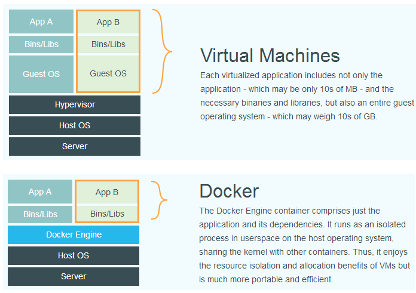
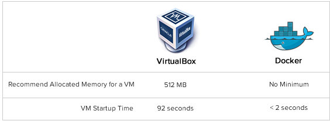
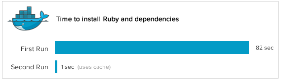
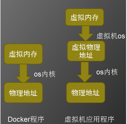
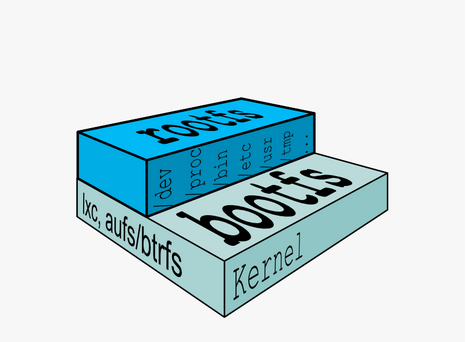
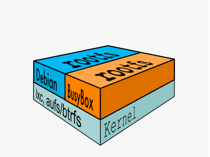
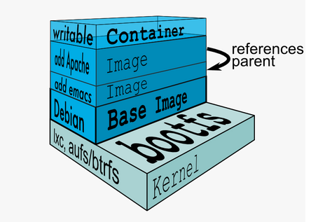

# Docker 基础培训-什么是Docker
## 1 介绍
Docker 是一个开源项目，诞生于 2013 年初，最初是 dotCloud 公司内部的一个业余项目。它基于 Google 公司推出的 Go 语言实现。 项目后来加入了 Linux 基金会，遵从了 Apache 2.0 协议，项目代码在 GitHub 上进行维护。

Docker 项目的目标是实现轻量级的操作系统虚拟化解决方案。 Docker 的基础是 Linux 容器（LXC）等技术。在 LXC 的基础上 Docker 进行了进一步的封装，让用户不需要去关心容器的管理，使得操作更为简便。用户操作 Docker 的容器就像操作一个快速轻量级的虚拟机一样简单。
## 2 Docker与传统虚拟化方式的不同
### 2.1 系统结构图对比

容器在操作层面进行虚拟化，直接复用了本地操作系统，而虚拟机必须在虚拟硬件层面再建立一层虚拟操作系统。
### 2.2 优缺点对比
#### 优点
##### 更少的抽象层

Docker 有着比虚拟机更少的抽象层。由于 Docker 不需要虚拟层实现硬件资源虚拟化，运行在容器上的程序直接使用的都是实际物理机的硬件资源。换而言之就是 Docker 的物理资源利用率高。
##### 启动时间 

Docker 不需要再建一个虚拟操作系统，当新建一个容器时，Docker 不需要和虚拟机一样重新加载一个操作系统内核。

- 虚拟机是分钟级。
- Docker 是秒级。

##### 模拟分布式架构线上环境

在单台物理机上新增一个操作系统的资源开销较大，因此，Docker 对比虚拟机在资源消耗上也占有比较大的优势。

- 虚拟机 数台
- Docker 百台

#### 缺点
##### 资源隔离性
Docker 是利用cgroup实现资源限制的，只限制资源消耗的最大值，而不能隔绝其他程序占用自己的资源，资源隔离方面不如虚拟机
##### 安全性问题
Docker 不能分辨具体执行指令的用户，只要用户拥有执行 Docker 的权限，那么就可以对 Docker 进行所有操作，不管该容器是否是由该用户创建。比如A和B都拥有执行 Docker 权限，A也可以删除B创建的容器，存在一定的安全风险。 
##### 版本兼容问题
Docker 目前还在版本还在快速更新中，细节和功能调整都比较大。新特使用的一些核心模块依赖于高版本内核，会造成上下兼容性问题。
## 3 为什么使用 Docker
### 3.1 更快速的交付和部署
对开发和运维（devop）人员来说，Docker 一次创建就可以在任意地方正常运行。容器的启动时间是秒级的，大量地节约开发、测试、部署的时间。
### 3.2 更高效的虚拟化
Docker 容器的运行不需要额外的虚拟化系统支持，是内核级的虚拟化，因此可以实现更高的性能和效率。
### 3.3 更轻松的迁移和扩展
Docker 容器几乎可以在任意的平台上运行，包括物理机、虚拟机、公有云、私有云、个人电脑、服务器等。 这种兼容性可以让用户把一个应用程序从一个平台直接迁移到另外一个。
### 3.4 更简单的管理
使用 Docker，只需要小小的修改，就可以替代以往大量的更新工作。所有的修改都以增量的方式被分发和更新，从而实现自动化并且高效的管理。
## 4 Docker 的原理
### 4.1 Docker 核心虚拟化方法
Docker核心解决的问题是利用LXC来实现类似VM的功能，从而利用更加节省的硬件资源提供给用户更多的计算资源。它一个操作系统级虚拟化方法, 理解起来可能并不像VM那样直观。
方法解决的问题：

- 隔离性

    每个用户实例之间相互隔离, 互不影响。LXC 利用 namespace。
- 可配置性

    每个用户实例可以按需提供其计算资源，所使用的资源可以被计量。LXC 利用 cgroups 来控制资源。
- 移动性
    
    用户的实例可以很方便地复制、移动和重建。提供snapshot和image来实现。最初aufs文件系统。
- 安全性
    
    这个话题比较大，这里强调是host主机的角度尽量保护container。LXC 利用用户的进程是lxc-start进程的子进程, 只是在Kernel的namespace中隔离的，所以需要加强内核保护。

### 4.2 Linux Namespace (ns)-命名空间

LXC所实现的隔离性主要是来自kernel的namespace, 其中包含pid, net, ipc, mnt, uts 等namespace将container的进程, 网络, 消息, 文件系统和hostname 隔离开。

#### pid namespace(容器pid隔离)

用户的进程是 lxc-start 进程的子进程, 不同用户的进程就是通过pid namespace隔离开的，且不同 namespace 中可以有相同PID。

#### net namespace（容器网络隔离）

网络隔离是通过 netnamespace 实现的， 每个net namespace有独立的 network devices, IP addresses, IP routing tables,/proc/net 目录。

#### ipc namespace（系统和容器的进程交互方法隔离）

container中进程交互还是采用linux常见的进程间交互方法(interprocess communication - IPC), 包括常见的信号量、消息队列和共享内存。容器的进程间交互实际上还是 host 上具有相同 pid namespace 中的进程间交互，IPC 资源申请时加入 namespace 信息为每个 IPC 资源有一个唯一的 32bit ID。

#### mnt namespace(容器根目录隔离)

mnt namespace允许不同namespace的进程看到的文件结构不同，这样每个 namespace 中的进程所看到的文件目录就被隔离开了。每个namespace中的容器在/proc/mounts的信息只包含所在namespace的mount point。

#### uts namespace(容器主机名隔离)

namespace允许每个容器拥有独立的主机名和domain name, 使其在网络上可以被视作一个独立的节点而非Host上的一个进程。

#### user namespace(容器用户隔离)

每个容器可以有不同的 user 和 group id, 容器内部的用户在容器内部执行程序而非Host上的用户。

### 4.3 Control Groups (cgroups)-控制组
cgroups 实现了对资源的配额和度量。 cgroups 的使用非常简单，提供类似文件的接口，在 /cgroup目录下新建一个文件夹即可新建一个group，在此文件夹中新建task 文件，并将pid写入该文件，即可实现对该进程的资源控制。cgroups可以限制哪些资源?

#### cpu
这里定义CPU轮转的优先级，因此具有较高CPU优先级的进程会更可能得到CPU运算。
#### cpusets
cpusets 定义了有几个CPU可以被这个group使用，或者哪几个CPU可以供这个group使用。
#### memory
内存使用数量
#### 其他
blkio、net_cls， cpuacct , devices , freezer 

### 4.4 Docker的分层文件系统介绍
####  Linux启动

bootfs (boot file system) 主要包含 bootloader 和 kernel,bootloader主要是引导加载kernel, 当boot成功后 kernel 被加载到内存中后 bootfs就被umount了. 

rootfs (root file system) 包含的就是典型 Linux 系统中的 /dev, /proc,/bin, /etc 等标准目录和文件。
####  Linux发行版本差异

对于不同的linux发行版, bootfs基本是一致的, rootfs会有差别, 因此不同的发行版可以公用bootfs.Linux在启动后，先将 rootfs 置为只读, 进行一系列检查, 然后将其切换为 "读写" 供用户使用。
####  Docker 

在docker中，也是将 rootfs 以只读的方式加载并检查，然后利用 union mount 的将一个读写文件系统挂载在只读的rootfs之上，并且允许再次将下层的文件系统设定为只读向上叠加, 这样一组只读和一个可写的结构构成了一个容器的运行目录, 每一个被称作一个Layer(层)。上层的image依赖下层的image，因此docker中把下层的image称作父image，没有父image的image称作base image。
# 参考资料
[Docker，从这里做起](http://www.csdn.net/article/2014-06-20/2820325-cloud-Docker)