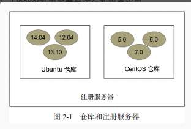

# Docker 基础培训 - 使用 Docker
## 1 基础概念
Docker 包括三个基本概念

- 镜像（Image）
- 容器（Container）
- 仓库（Repository）

### 1.1 Docker 镜像
镜像就是一个只读的模板(可以认为是个虚拟CD盘)，上面可以安装一整套ubuntu操作系统，也可以只安装了一个应用程序。镜像是只读的。
### 1.2 Docker 容器
利用镜像创建的一个运行环境的实例(可以认为是一个运行中的简化版虚拟机，包括root用户权限、进程空间、用户空间和网络空间等)。
### 1.3 Docker 仓库

仓库是集中存放镜像文件的场所。有时候会把仓库(Repository)和仓库注册服务器（Registry）混为一谈，并不严格区分。实际上，仓库注册服务器上往往存放着多个仓库，每个仓库中又包含了多个镜像，每个镜像有不同的标签（tag）。仓库分为公开仓库（Public）和私有仓库（Private）两种形式。

## 2 Docker 安装
### 2.1 安装前注意
现有docker还在飞速发展中，新版本层出不穷，为了避免兼容性问题，我公司产品定义只兼容docker 1.7.1以上版本。故此，请检查系统版本：

- centos 7.0以上
- ubuntu 14.04以上

### 2.2 Ubuntu
安装脚本

    $ sudo apt-get install apt-transport-https
    $ sudo apt-key adv --keyserver hkp://keyserver.ubuntu.com:80 --recv-keys 36A1D7869245C8950F966E92D8576A8BA88D21E9
    $ sudo bash -c "echo deb https://get.docker.io/ubuntu docker main > /etc/apt/sources.list.d/docker.list"
    $ sudo apt-get update
    $ sudo apt-get install lxc-docker
安装后应该直接启动，如果没有使用下面命令启动即可  

    $ sudo service docker start
### 2.3 Centos
安装脚本

    $ sudo yum install docker
安装后应该直接启动，如果没有使用下面命令启动即可

    $ sudo service docker start
    $ sudo chkconfig docker on
## 3 Docker 镜像操作
### 3.1 获取镜像
使用`docker pull`命令获取镜像。
#### 从 Docker Hub 获取 base 镜像 ubuntu 系统，版本12.04
下载过程中，会获取镜像的每一层信息，以下命令相当于执行了`$ sudo docker pull registry.hub.docker.com/ubuntu:12.04`

    $ sudo docker pull ubuntu:12.04
    Pulling repository ubuntu
    ab8e2728644c: Pulling dependent layers
    5f0ffaa9455e: Download complete
    a300658979be: Download complete
    904483ae0c30: Download complete
    ....
#### 其他仓库下载

    $ sudo docker pull regsitry.shurenyun.com:5000/ubuntu:12.04
    Pulling regsitry.shurenyun.com:5000/ubuntu
    ab8e2728644c: Pulling dependent layers
    511136ea3c5a: Download complete
    5f0ffaa9455e: Download complete
    a300658979be: Download complete
    ....
### 3.2 列出本地镜像
使用`docker images`显示本地已有的镜像。

    $ sudo docker images
    REPOSITORY       TAG      IMAGE ID      CREATED      VIRTUAL SIZE
    ubuntu           14.04    99ec81b80c55  4 weeks ago  266 MB
    ...
参数描述

    REPOSITORY  来自于哪个仓库，什么软件比如 ubuntu
    TAG         镜像标记，比如 14.04
    IMAGE ID    镜像ID 号（唯一）
    CREATED     创建了多久
    VIRTUAL SIZE镜像大小
### 3.3 创建镜像
创建镜像通常有两种方法:

- 用现有镜像加内容生成新镜像

- 用dockerfile生成新镜像

#### 现有镜像生成
先使用现有镜像启动容器

    $ sudo docker run -t -i ubuntu:14.04 /bin/bash
    root@0b2616b0e5a8:/#
记住容器的 ID:0b2616b0e5a8,并按照对应linux方法安装应用

    root@0b2616b0e5a8:/# yum -y install nginx
安装结束后，使用exit退出容器，然后使用`docker commit`命令提交新的镜像。

    $ sudo docker commit -m "Added nginx" -a "Docker pro" 0b2616b0e5a8 ubuntu/nginx:v1
    4f177bd27a9ff0f6dc2a830403925b5360bfe0b93d476f7fc3231110e7f71b1c
参数描述

    -m                 来指定提交的说明信息，跟我们使用的版本控制工具一样；
    -a                 可以指定更新的用户信息；
    0b2616b0e5a8       是用来创建镜像的容器实例ID；
    ubuntu/nginx:v1    指定目标镜像的仓库名和 tag 信息。
    4f177bd27a9ff...   创建成功后会返回这个镜像的 ID 信息。
#### dockerfile 生成
和刚才一样用docekrfile重做一遍，首先生成dockerfile文件

    mkdir -p /data/tools/nginx/ && cd /data/tools/nginx/
    vi Dockerfile
    # This is a comment
    FROM ubuntu:14.04
    MAINTAINER Docker pro <pro@xxx.com>
    RUN apt-get update
    RUN apt-get -qqy install nginx
参数描述

    使用#来注释
    FROM         指令告诉 Docker 使用哪个镜像作为基础
    MAINTAINER   是维护者的信息
    RUN          开头的指令会在创建中运行，比如安装一个软件包，在这里使用 apt-get 来安装了一些软件

文件写完后退出编辑文件，生成镜像

    sudo docker build -t ubuntu/nginx:v1 .
    Uploading context  2.56 kB
    Uploading context
    Step 0 : FROM ubuntu:14.04
     ---> 99ec81b80c55
    ...
     ---> 324104cde6ad
    Removing intermediate container 5e9d0065c1f7
    Successfully built 324104cde6ad
参数说明

    -t     标记来添加 tag，指定新的镜像的用户信息。
    “.”    是 Dockerfile 所在的路径（当前目录），也可以替换为一个具体的 Dockerfile 的路径。
上传镜像
用户可以通过`docker push`命令,默认推到dockerhub上

    $ sudo docker push ubuntu/nginx:v1
    The push refers to a repository [ubuntu/nginx:v1] (len: 1)
    Sending image list
    .....
### 3.4 导出导入镜像
使用`docker save -o`将镜像导出成`tar`包

    sudo docker save -o ubuntu_14.04.tar ubuntu:14.04
使用`docker load`将`tar`包导入镜像

    sudo docker load --input ubuntu_14.04.tar
    or
    sudo docker load < ubuntu_14.04.tar
### 3.5 移除镜像
使用`docker rmi`命令移除本地镜像，注意`docker rm`移除的是容器实例。在删除镜像之前要先用`docker rm`删掉依赖于这个镜像的所有容器。

    $ sudo docker rmi ubuntu/nginx:v1
## 4 容器实例操作
### 4.1 启动容器实例
启动容器分两种情况，第一种是新建启动，第二种是关闭实例启动。
#### 新建启动
使用`docker run`启动容器实例，分2种情况

1 命令输出一个 “Hello World”，之后终止容器

    $ sudo docker run ubuntu:14.04 /bin/echo 'Hello world'
    Hello world
2 启动一个 bash 终端，允许用户进行交互

    $ sudo docker run -t -i ubuntu:14.04 /bin/bash
    root@af8bae53bdd3:/#
参数说明

    -t 选项让Docker分配一个伪终端（pseudo-tty）并绑定到容器的标准输入上
    -i 则让容器的标准输入保持打开。
#### 关闭实例启动
使用`docker start`启动关闭实例
查看关闭实例

    docker ps -a
    CONTAINER ID        IMAGE                                                              COMMAND                  CREATED             STATUS                     PORTS                    NAMES
    8e712339857b        centos7/jdk8/jenkins1.628/base                                     "/bin/bash"              4 days ago          Exited (137) 5 seconds ago        jenkins
启动关闭实例

    docker start jenkins
### 4.2 守护进程启动(后台运行)
Docker在后台运行而不是直接把执行命令的结果输出在当前宿主机下。此时，可以通过添加 -d 参数来实现。

对比测试

不使用`-d`参数,结果(STDOUT)打印到宿主机上面

    sudo docker run ubuntu:14.04 /bin/sh -c "while true; do echo hello world; sleep 1; done"
    hello world
    hello world
    hello world
    ......
使用了`-d`参数运行容器

    $ sudo docker run -d ubuntu:14.04 /bin/sh -c "while true; do echo hello world; sleep 1; done"
    77b2dc01fe0f3f1265df143181e7b9af5e05279a884f4776ee75350ea9d8017a
使用`docker ps`命令来查看容器信息

    $ sudo docker ps
    CONTAINER ID  IMAGE         COMMAND               CREATED        STATUS       PORTS NAMES
    77b2dc01fe0f  ubuntu:14.04  /bin/sh -c 'while tr  2 minutes ago  Up 1 minute        agitated_wright
通过`docker logs`命令查看容器日志

    $ sudo docker logs [container ID or NAMES]
    hello world
    hello world
    ....
### 4.3 终止容器实例
可以使用`docker stop`来终止一个运行中的容器,如果是使用非后台模式启动的容器，也可以使用`exit`或者`Ctrl+D`来退出中断终止容器。
使用`docker ps`命令来查看容器信息

    $ sudo docker ps
    CONTAINER ID  IMAGE         COMMAND               CREATED        STATUS       PORTS NAMES
    77b2dc01fe0f  ubuntu:14.04  /bin/sh -c 'while tr  2 minutes ago  Up 1 minute        agitated_wright
使用`docker stop`来终止这个容器

    $ sudo docker stop CONTAINER ID or NAMES
当然也可以使用`docker restart`来重启这个容器

    $ sudo docker restart CONTAINER ID or NAMES
### 4.4 进入容器实例
当`-d`参数容器进入后台运行后，某些时候需要进入容器进行操作，有很多种方法，包括使用`docker attach`命令或`docker exec`等。
使用`docker ps`命令来查看容器信息

    $ sudo docker ps
    CONTAINER ID  IMAGE         COMMAND               CREATED        STATUS       PORTS NAMES
    77b2dc01fe0f  ubuntu:14.04  /bin/sh -c 'while tr  2 minutes ago  Up 1 minute        agitated_wright
#### docker attach
使用`docker attach`时，程序会打开`-d`程序的前端(开发、测试环境使用，严禁生成产使用)

    $ sudo docker attach 77b2dc01fe0f
如果`Ctrl+D`关闭，原先的程序会关闭

    $ sudo docker ps
    CONTAINER ID  IMAGE         COMMAND               CREATED        STATUS       PORTS NAMES
#### docker exec
使用`docker exec`时,程序会打开运行容器的另一个`bash`环境，这样在退出时就不会影响到之前`docker run`的程序了.

    $ sudo docker exec -it  77b2dc01fe0f /bin/bash
    [root@77b2dc01fe0f /]# exit

    $ sudo docker ps
    CONTAINER ID  IMAGE         COMMAND               CREATED        STATUS       PORTS NAMES
    77b2dc01fe0f  ubuntu:14.04  /bin/sh -c 'while tr  2 minutes ago  Up 1 minute        agitated_wright
### 4.5 容器实例快照导入导出
####  导出容器实例
使用`docker export`命令,注意容器实例要关闭状态

    $ sudo docker ps -a
    CONTAINER ID        IMAGE               COMMAND             CREATED             STATUS                    PORTS               NAMES
    7691a814370e        ubuntu:14.04        "/bin/bash"         36 hours ago        Exited (0) 21 hours ago                       test
    $ sudo docker export 7691a814370e > ubuntu.tar
#### 导入容器实例快照
可以使用`docker import`从容器快照再导入镜像

    $ cat ubuntu.tar | sudo docker import - test/ubuntu:v1.0
    $ sudo docker images
    REPOSITORY          TAG                 IMAGE ID            CREATED              VIRTUAL SIZE
    test/ubuntu         v1.0                9d37a6082e97        About a minute ago   171.3 MB
#### 远程导入

    $sudo docker import http://example.com/exampleimage.tgz example/imagerepo

### 4.5 删除实例
可以使用 `docker rm`删除实例，删除一个终止状态的容器实例

    $sudo docker rm  trusting_newton
    trusting_newton  
也可以增加`-f`参数来删除一个运行中的容器实例

    $sudo docker rm  -f trusting_newton
    trusting_newton
## 5 仓库
### 5.1 Docker Hub
目前 Docker 官方维护了一个公共仓库 Docker Hub，其中已经包括了超过 15,000 的镜像。大部分需求，都可以通过在 Docker Hub 中直接下载镜像来实现。
#### 登录
可以通过`docker login`来登录，输入账户密码邮箱后完成注册和登录，登录后会在本地用户目录生成一个`.dockercfg`用户认证信息文件。
#### 基本操作
使用`docker search`来查询 Docker Hub 中的镜像，并可以使用`docker pull`下载到本地。

    $ sudo docker search centos
    NAME                                            DESCRIPTION                                     STARS     OFFICIAL   AUTOMATED
    centos                                          The official build of CentOS.                   465       [OK]
    ...
参数名

    NAME        镜像的名字
    DESCRIPTION 镜像描述
    STARS       欢迎程度
    OFFICIAL    是否是官方提供镜像
    AUTOMATED   是否允许用户验证镜像内容和来源
使用`docker pull`下载镜像到本地

    $ sudo docker pull centos
    Pulling repository centos
    0b443ba03958: Download complete
    539c0211cd76: Download complete
    ....
### 5.2 私有仓库
#### 启动私有仓库
有的时候公共仓库不方便，用户可以在本地创建一个私有库，使用官方提供的registry镜像创建。默认情况下，仓库会被创建在容器的 /tmp/registry 下，通过`－v`参数来指定本地磁盘存储

    $ sudo docker run -d -p 5000:5000 -v /opt/data/registry:/tmp/registry registry
#### 上传镜像
将镜像`tag`修改

    $ sudo docker images
    REPOSITORY                        TAG                 IMAGE ID            CREATED             VIRTUAL SIZE
    ubuntu                            latest              ba5877dc9bec        6 weeks ago         192.7 MB
    ubuntu                            14.04               ba5877dc9bec        6 weeks ago         192.7 MB
使用`docker tag`将`ba58`这个镜像标记为`192.168.7.26:5000/test`

    $ sudo docker tag ba58 192.168.7.26:5000/test
    root ~ # docker images
    REPOSITORY                        TAG                 IMAGE ID            CREATED             VIRTUAL SIZE
    ubuntu                            14.04               ba5877dc9bec        6 weeks ago         192.7 MB
    ubuntu                            latest              ba5877dc9bec        6 weeks ago         192.7 MB
    192.168.7.26:5000/test            latest              ba5877dc9bec        6 weeks ago         192.7 MB    
使用`docker push`上传标记的镜像

    $ sudo docker push 192.168.7.26:5000/test
    The push refers to a repository [192.168.7.26:5000/test] (len: 1)
    Sending image list
    Pushing repository 192.168.7.26:5000/test (1 tags)
    Image 511136ea3c5a already pushed, skipping
    Image 9bad880da3d2 already pushed, skipping
    ...
    Pushing tag for rev [ba5877dc9bec] on {http://192.168.7.26:5000/v1/repositories/test/tags/latest}
#### 查询镜像
用`curl`查看仓库中的镜像。

    $ curl http://192.168.7.26:5000/v1/search
    {"description": "", "name": "dockerfile/ubuntu"}, {"description": "", "name": "library/test"}]}
#### 下载镜像
到另外一台机器使用`docker pull`下载

    $ sudo docker pull 192.168.7.26:5000/test
    Pulling repository 192.168.7.26:5000/test
    ba5877dc9bec: Download complete
    ....
    $ sudo docker images
    REPOSITORY                         TAG                 IMAGE ID            CREATED             VIRTUAL SIZE
    192.168.7.26:5000/test             latest              ba5877dc9bec        6 weeks ago         192.7 MB
## 6 数据卷
数据卷的使用，类似于 Linux 下对目录或文件进行 mount，镜像中的被指定为挂载点的目录中的文件会隐藏掉，能显示看的是挂载的数据卷。有以下特性。

- 数据卷可以在容器之间共享和重用
- 对数据卷的修改会立马生效
- 对数据卷的更新，不会影响镜像
- 数据卷默认会一直存在，即使容器被删除

### 6.1 生成一个数据卷
在用`docker run`命令的时候，使用`-v`标记来创建一个数据卷并挂载到容器里。在一次 run 中多次使用可以挂载多个数据卷。

    $ sudo docker run -d -P --name web -v /webapp training/webapp python app.py
### 6.2 删除数据卷
删除容器的时候使用`docker rm -v`这个命令
### 6.3 挂载一个主机目录作为数据卷
使用`-v`标记也可以指定挂载一个本地主机的目录到容器中去。

    $ sudo docker run -d -P --name web -v /src/webapp:/opt/webapp python app.py
### 6.4 挂载卷只读
Docker 挂载数据卷的默认权限是读写，用户也可以通过 :ro 指定为只读。

    $ sudo docker run -d -P --name web -v /src/webapp:/opt/webapp:ro python app.py
### 6.5 查看数据卷的具体信息
使用`docker inspect`查看具体信息

    $ docker inspect web
    ...
    "Volumes": {
    "/webapp": "/var/lib/docker/volumes/fac362...80535"
    },
    "VolumesRW": {
    "/webapp": true
    }
    ...
### 6.6 挂载一个本地主机文件作为数据卷
`-v`标记也可以从主机挂载单个文件到容器中

    $ sudo docker run --rm -it -v ~/.bash_history:/.bash_history ubuntu /bin/bash
### 6.7 挂载数据盘到其他节点
创建一个名为 dbdata 的数据卷容器：

    $ sudo docker run -d -v /dbdata --name dbdata training/postgres echo Data-only container for postgres
其他容器中使用 --volumes-from 来挂载 dbdata 容器中的数据卷。

    $ sudo docker run -d --volumes-from dbdata --name db1 training/postgres
    $ sudo docker run -d --volumes-from dbdata --name db2 training/postgres
从其他已经挂载了数据卷的容器来级联挂载数据卷

    $ sudo docker run -d --name db3 --volumes-from db1 training/postgres
###  6.8 备份数据卷
使用 --volumes-from 标记来创建一个加载 dbdata 容器卷的容器，并从主机挂载当前目录到容器的 /backup，并备份/data挂载数据卷数据。

    $ sudo docker run --volumes-from dbdata -v $(pwd):/backup ubuntu tar cvf /backup/backup.tar /dbdata

### 6.9 恢复
创建一个带有空数据卷的容器 dbdata2

    $ sudo docker run -v /dbdata --name dbdata2 ubuntu /bin/bash
创建另一个容器，挂载 dbdata2 容器卷中的数据卷，并使用 untar 解压备份文件到挂载的容器卷中。

    $ sudo docker run --volumes-from dbdata2 -v $(pwd):/backup busybox tar xvf /backup/backup.tar
再启动一个容器挂载同样的容器卷来查看

    $ sudo docker run --volumes-from dbdata2 busybox /bin/ls /dbdata
## 7 网络
容器可以使用 -P 或 -p 参数来指定端口映射
### 7.1 映射49000~49900随机端口(非服务端口)

    $ sudo docker run -d -P training/webapp python app.py
    $ sudo docker ps -l
    CONTAINER ID  IMAGE                   COMMAND       CREATED        STATUS        PORTS                    NAMES
    bc533791f3f5  training/webapp:latest  python app.py 5 seconds ago  Up 2 seconds  0.0.0.0:49155->5000/tcp  nostalgic_morse
参数

     -P(大) 标记时，Docker 会随机映射一个 49000~49900 的端口到内部容器开放的网络端口。
### 7.2 映射指定端口

    $ sudo docker run -d -p 5000:5000 training/webapp python app.py
参数

    -p (小)使用  ip:hostPort:containerPort 格式本地的 5000 端口映射到容器的 5000 端口
### 7.3 映射到指定地址的任意端口

    $ sudo docker run -d -p 127.0.0.1::5000 training/webapp python app.py
参数    

    -p (小)使用 ip::containerPort 绑定 localhost 的任意端口到容器的 5000 端口
### 7.4 udp端口

    $ sudo docker run -d -p 127.0.0.1:5000:5000/udp training/webapp python app.py
### 7.5 查看映射端口
使用`docker port`查看当前映射端口

    $ docker port nostalgic_morse 5000
    127.0.0.1:49155.    
### 7.6 容器互联
如果多个容器实例在同一台机器上启动，就可以使用`--link`进行互联

使用`--name`标记可以为容器自定义命名。

    $ sudo docker run -d --name db training/postgres
创建web服务并连接到db容器实例

    $ sudo docker run -d -P --name web --link db:db training/webapp python app.py
参数介绍

    --link 参数的格式为 --link name:alias，其中 name 是要链接的容器的名称，alias 是这个连接的别名。
使用`docker ps`来查看容器的连接

    $ docker ps
    CONTAINER ID  IMAGE                     COMMAND               CREATED             STATUS             PORTS                    NAMES
    349169744e49  training/postgres:latest  su postgres -c '/usr  About a minute ago  Up About a minute  5432/tcp                 db, web/db
    aed84ee21bde  training/webapp:latest    python app.py         16 hours ago        Up 2 minutes       0.0.0.0:49154->5000/tcp  web

Docker 在两个互联的容器之间创建了一个安全隧道，而且不用映射它们的端口到宿主主机上。在启动 db 容器的时候并没有使用 -p 和 -P 标记，从而避免了暴露数据库端口到外部网络上。
