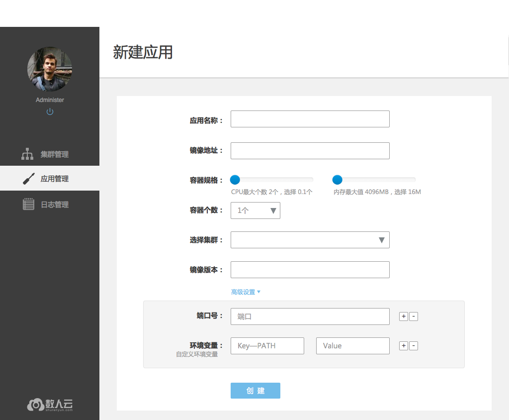
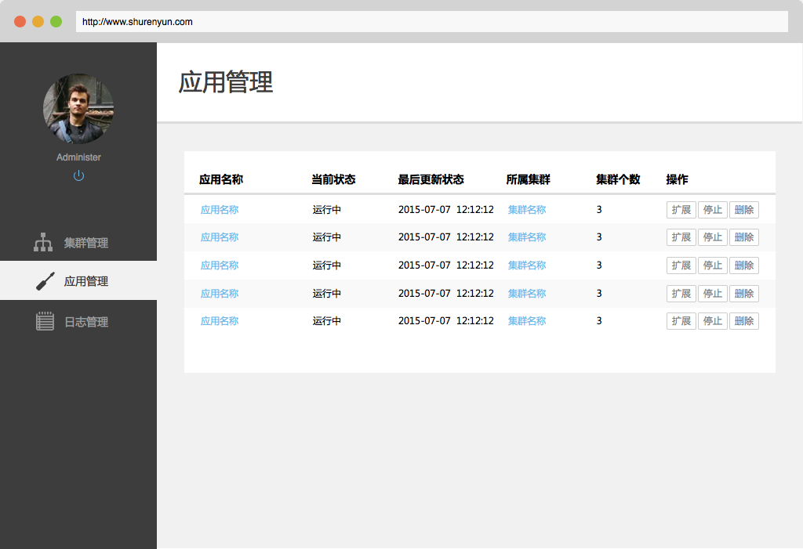
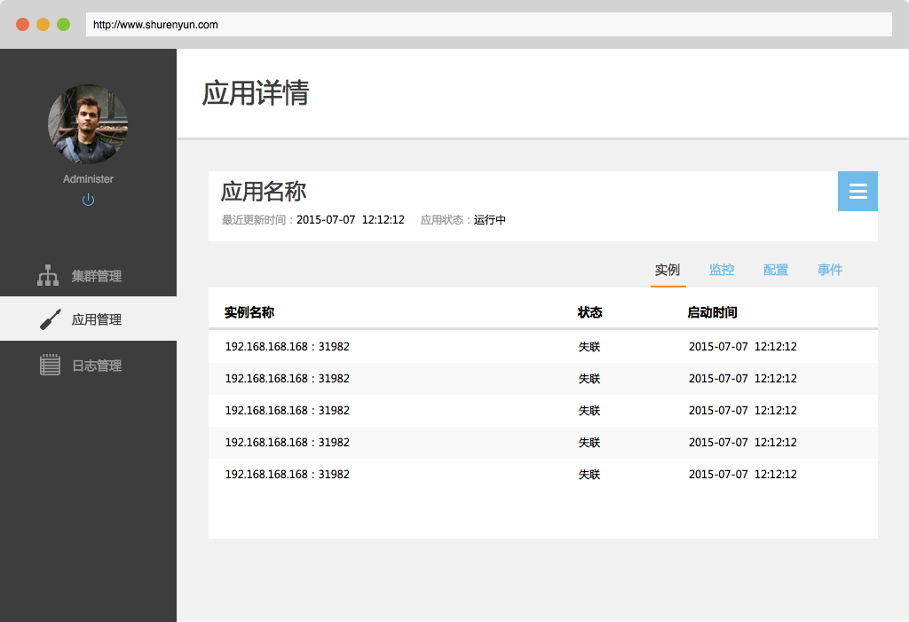
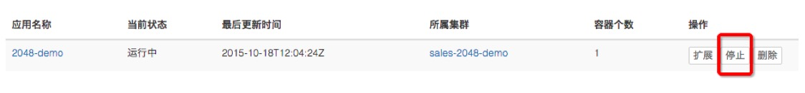
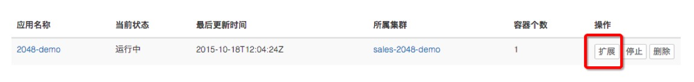

# 应用管理

主要负责部署应用和管理应用的生命周期。可以添加、删除、启动、停止应用。还可以弹性扩展应用实例数量。

<h2 id="app">1. 创建/删除应用</h2>

### 1.1 新建应用

用户通过新建应用向指定的集群中部署一个新的应用。

* 同一集群中的应用不可重名；     
* 新建应用时配置的端口、规格、环境参数等在应用成功运行后不能修改。

* 应用名称：所要发布的应用名字，如：2048小游戏
* 镜像地址：Docker容器镜像地址，如：alexwhen/docker-2048  [了解更多Docker知识>>](docker/2/Docker.md)
* 容器规格：调整每个容器实例所占用的CPU和内存大小
* 选择集群：将应用发布到所选择的已有集群上
* 镜像版本：镜像版本号，如：latest
* 端口号：Docker内的服务端口号
* 环境变量：Docker内部的系统环境变量

### 1.2 删除应用

用户可以删除一个应用，在应用管理页和应用详情页都有删除按钮可以删除应用。应用一旦被删除，相关的数据也将一并在集群中删除且不可通过数人云平台恢复。     

<h2 id="check">2. 查看应用</h2>

### 2.1 应用列表

当成功向集群部署应用后，用户可以在应用管理页看到所有成功部署的应用，包括这些应用当前的状态以及可以对应用进行的操作，启动/停止、扩展、删除，这些操作在应用详情页同样可以进行。     

### 2.2 应用详情

用户在应用详情能看到应用的状态、分布于哪些实例、配置信息（包括容器规格、端口和环境变量）、以及应用的事件。当前版本，配置信息不可修改，若需要修改，则需要新建应用，事件，记录了应用从第一次成功部署到被删除之前的发生的变化过程。

    

<h2 id="start">3. 启动/停止应用</h2>

用户可以停止正在运行的应用，也可以再次启动它。在应用列表和应用详情都有启动/停用按钮。    

<h2 id="elastic">4、应用伸缩</h2>

用户按照应用的需要扩充或缩减实例的个数，同样，在应用列表和应用详情都有扩展按钮可以进行这项操作。 与新建应用时调整容器个数的操作方式一样。    

<h2 id="monitor">5. 应用监控</h2>

用户能在应用详情页看到监控信息，包括该应用使用的CPU、内存和磁盘，这个应用所在的集群上所有应用对资源的使用，从而，用户也能够看到集群中剩余的可用资源。   
