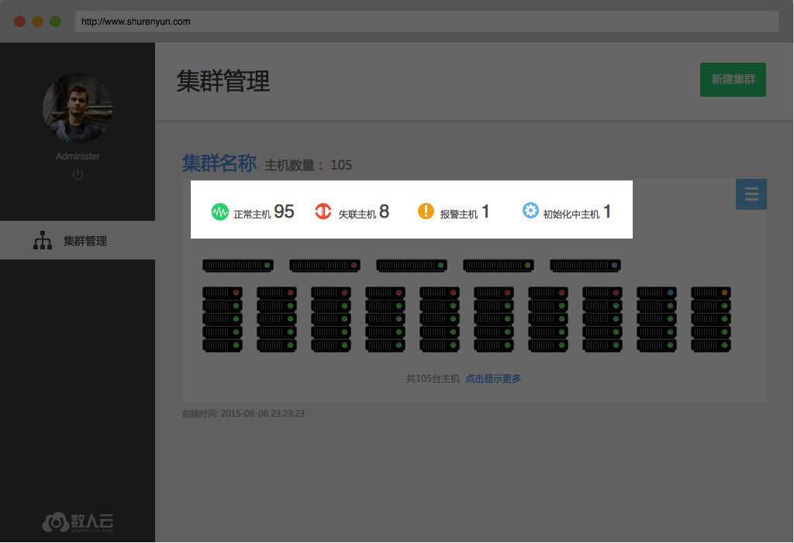

# 集群管理

数人云的集群管理功能可将底层服务器集群统一管理，变成一个资源池供用户使用。不同业务或应用可混跑在同一个集群中。
从而提高集群运维管理效率和集群资源利用率。

用户能够创建集群并加入一定数量的主机搭建出可支持分布式管理的集群结构，并且根据主机的数量不同可选择不同的
集群结构。删除集群，通过中断主机与管理节点的联系来消除集群的结构。

备注：

1 master, 开发环境使用， 适合6台主机以内使用。

3 master, 基础生产环境使用，适合30台主机以内使用。

5 master, 高容错级生产环境使用，适合30台主机以上使用。

<h2 id="cluster">1. 创建/删除集群</h2>

### 1.1 创建集群

只需输入集群名称就可以建立一个新的集群，当然，还需要用户进一步添加主机（详见2、添加/删除主机）才能构成真正可以工作的集群。创建集群时可以根据集群规模选择在集群中安装 1、3 或 5 个master。当集群中主机数量 > 10时建议选择3master，当主机数 >30 时5 master 更适合。

    

### 1.2 删除集群

用户在集群管理、集群详情页面都可以删除集群，确认删除后，数人云平台会停止集群上运行的所有应用、组件，但应用产生的业务数据依然保留在原主机上。

<h2 id="host">2. 添加/删除主机</h2>

### 2.1 添加主机

用户在集群管理页、集群详情页都可以找到“添加主机”。向集群添加主机，首先需要在主机上安装Docker，再安装数人云的主机监控程序。添加成功后，用户可以点击完成转向集群详情页，就可以在主机列表中看到这台主机，也可以选择继续添加其他主机，进行相同的操作即可。提醒：向同一集群添加的主机应存在于同一网段内，暂不支持跨公网的主机组建集群。

注：当作为master的主机出现异常时，新添加其他主机进入集群，需要保证新加入要做master的这台为同样的IP。  

        

### 2.2 删除主机   
即将主机从该集群中删除，在集群详情页选择想要删除的主机，点击删除主机按钮并确认。
**删除主机并不删除主机上的应用数据，** 但会停止主机监控程序，即agent，从而无法通过数人云平台的集群管理访问该主机。     

    

<h2 id="view">3. 集群/主机监控</h2>

### 3.1 集群监控

**集群正常状态**

集群正常工作时，用户可以在集群管理页看到集群中4种主机状态下各有多少台主机，以及集群中每一个master的运行状态。     

**集群异常状态**

当集群中超过半数的master为非正常状态时，集群也将被标识为异常状态，如下图所示。

   

**集群中的主机**

集群管理页和集群详情页（可由查看集群进入）都能看到集群中的主机，每个主机的图形、文字符号，也都可以转向主机的详情页面（详见4、查看主机）。     

### 3.2 主机监控

主机整体的运行状态，在主机列表中均有标识，无论是集群管理页的图形化主机列表还是集群详情页的表格、文字主机列表。
主机有4种运行状态：

* 正常，主机监控程序及数人云平台管理组件都正常运行，平台可以向主机分发应用、下发任务；    
* 异常，主机监控程序可以与数人云平台通信，但是管理组件已无法正常接收、执行平台下发的任务；    
* 失联，主机监控程序与数人云平台的通信中断；    
* 初始化中，主机监控程序正常运行，正在初始化数人云平台的管理组件。

  
