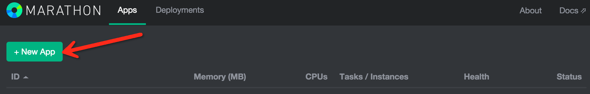
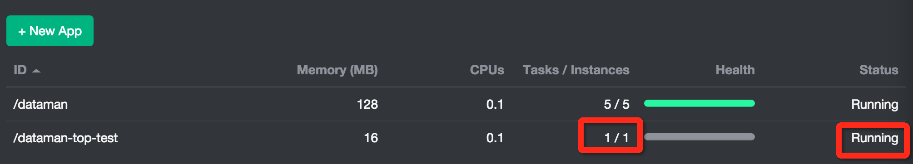
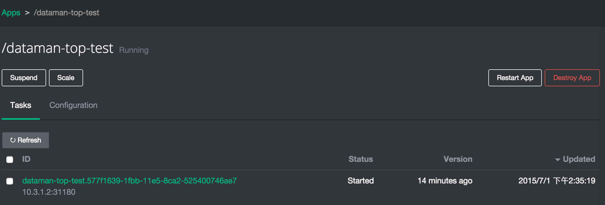
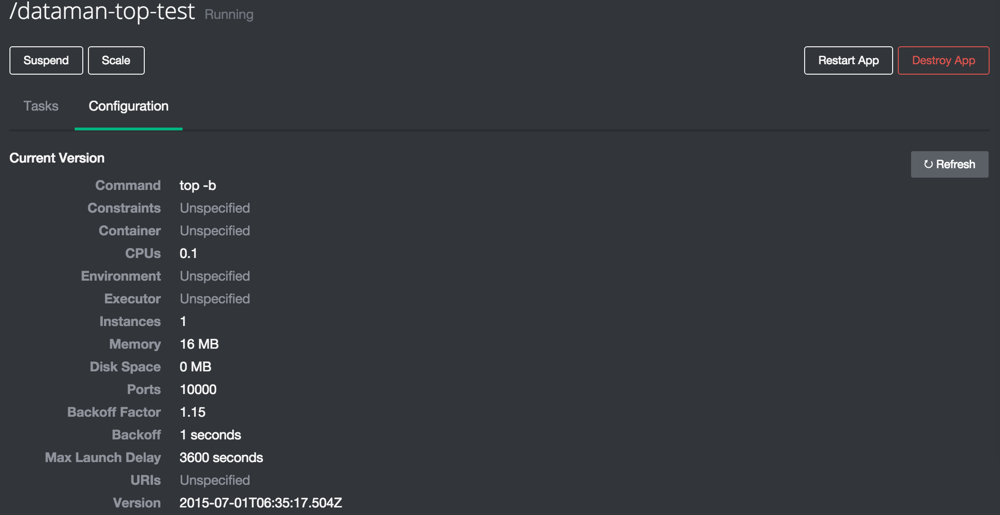
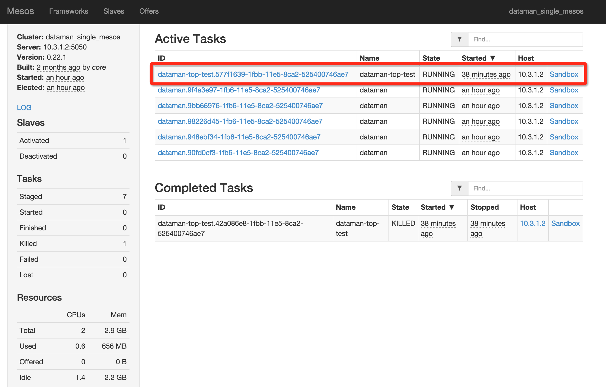
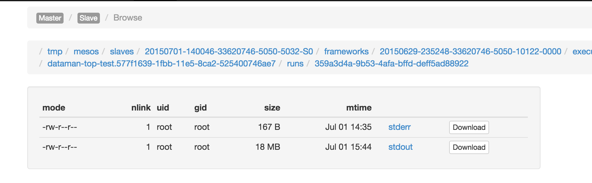
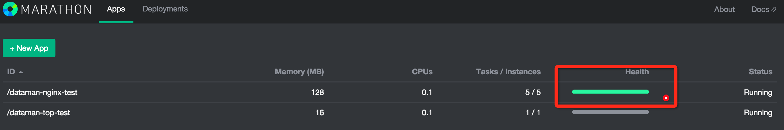
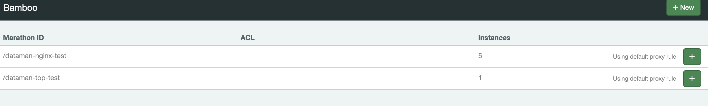
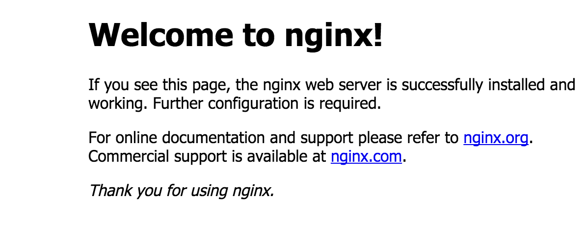

## 通过Mesos默认调度框架Marathon创建简单使用样例
创建Marathon任务有2种方法:通过web－ui和使用json脚本的方法，下面就通过简单实例进行说明。
### 用webui创建一个top任务(非docker)
#### 打开marathon－web-ui界面
    http://你安装mesos系统的机器ip地址:8080
##### 创建新任务(点击+NewApp)

##### 填写本次任务的数据信息
    #任务名(很重要,参考后面nginx例子)
    ID         dataman-top-test
    #任务需要使用cpu最小大小
    CPUs       0.1
    #任务需要使用内存最小容量
    Memory     16 
    #任务需要使用磁盘大小
    Disk       0
    #需要同时跑几个任务
    Instances  1
    #执行器执行命令
    Command    top -b
    #执行器
    Executor   空
    #容器调度Slave端口方法
    Ports
    #通过wget模式将容器外部资源动态的获取到容器内部的work_dir中
    URIs       空
    #约束
    Constraints 空
##### 执行创建任务(点击+Create) 

##### marathon创建过程

    可以看到marathon的任务表中显示的任务状态
    任务id(/dataman-top-test)
    内存信息(16)
    cpu信息(0.1)
    运行实例信息(0/1)
    健康心跳状态(空)
    状态(Deploying)
##### 创建结束查看结果

    和创建过程信息一样，但是已经可以看到运行实力信息(1/1),状态是(Running)
##### 进入单一任务详细状态

    点击任务名进入单一任务详细操作界面
    Suspend 将任务设置为空
    Scale   动态设置任务数量
    Refresh 刷新
    Restart App 重启任务
    Destroy App 删除任务
    version 任务已创建时间
    Updated 最新任务操作时间
##### 查看任务数据信息

    点击Configuration任务创建的数据信息，同4.1.3类似
#### 打开mesos-master
    http://你安装mesos系统的机器ip地址:5050
##### mesos-master总览

##### mesos-master信息
    左上角可以看到mesos-master信息，包括集群名、masterip、创建时间、集群启动时间等
##### LOG    
    LOG可以查看mesos-master的实时运行日志
##### Slaves
    Activated    #集群中存活的从机数量
    Deactivated  #集群中死亡的从机数量
##### Task
    #这里说明这个统计是从Mesos启动后的累加值，并不是当前状态，仅供参考
    Staged   #创建过任务的数量
    Started	#正在开始任务的数量
    Finished	#任务正常完成的数量
    Killed	#任务手动取消的数量
    Failed	#任务执行失败的数量
    Lost	   #任务丢失的数量
##### Resources
    #统计集群cpu和内存资源情况
    Total 总资源
    Used	使用资源
    Offered 申请资源
    Idle	空闲资源
##### Active Tasks
    #正在运行的任务统计
    这里可以看到刚才创建的任务
##### Sandbox

    #这里可以查看任务运行内部的动态日志，包括正确和错误的
   stderr
   
    #日志样例
    I0701 14:35:19.243409  5881 exec.cpp:132] Version: 0.22.1
    I0701 14:35:19.246486  5883 exec.cpp:206] Executor registered on slave 20150701-140046-33620746-5050-5032-S0
    
   stdout
   
    #日志样例
    5508 root      20   0    4440    636    536 S   0.0  0.0   0:00.00 sh
    5509 root      20   0  125208   9348   4932 S   0.0  0.2   0:00.06 docker
    5564 root      20   0  141600  10904   4408 S   0.0  0.3   0:00.06 docker
    5585 root      20   0    4440    652    548 S   0.0  0.0   0:00.01 sh
    5591 root      20   0   85876   4056   2952 S   0.0  0.1   0:00.00 nginx
    5592 www-data  20   0   86216   2016    604 S   0.0  0.0   0:00.09 nginx
    5593 www-data  20   0   86216   1760    460 S   0.0  0.0   0:00.20 nginx
    5594 www-data  20   0   86216   1760    460 S   0.0  0.0   0:00.17 nginx
    5595 www-data  20   0   86216   1760    460 S   0.0  0.0   0:00.17 nginx
    5596 root      20   0    4440    648    544 S   0.0  0.0   0:00.00 sh
    5597 root      20   0    4440    644    544 S   0.0  0.0   0:00.00 sh
    5598 root      20   0  736344  11648  10076 S   0.0  0.3   0:05.34 mesos-exec+
    ........

##### Completed Tasks
    #集群启动后完成的任务(不一定是成功，也有失败等状态)

### 用json脚本开放一个nginx网络服务
#### 首先创建一个Nginx的dockerfile
    vi dockerfile
    FROM ubuntu
    MAINTAINER zpang zpang@dataman-inc.com
    #install nginx
    RUN apt-get update
    RUN apt-get install -y nginx
    # forward request and error logs to docker log collector
    RUN ln -sf /dev/stdout /var/log/nginx/access.log
    RUN ln -sf /dev/stderr /var/log/nginx/error.log
    #off nginx daemon
    RUN echo "daemon off;" >> /etc/nginx/nginx.conf
#### 使用dockerfile生成docker镜像
    #生成docker
    docker build -t ubuntu-nginx-base .
    #查看镜像
    docker images
    REPOSITORY          TAG                 IMAGE ID            CREATED             VIRTUAL SIZE
    ubuntu-nginx-base   latest              c5dc79088bb8        41 hours ago        227.5 MB
#### 生成Json启动脚本
    vi dataman-nginx-test.sh
    curl -v -X POST http://127.0.0.1:8080/v2/apps -H Content-Type:application/json -d \
    '{
          "id": "dataman-nginx-test",
          "cmd": "nginx",
          "cpus": 0.1,
          "mem": 128.0,
          "instances": 5,
          "container": {
                         "type": "DOCKER",
                         "docker": {
                                         "image": "ubuntu-nginx-base",
                                         "network": "BRIDGE",
                                         "portMappings": [
                                                           { "containerPort": 80, "hostPort": 0, "servicePort": 10000, "protocol": "tcp" }
                                                         ]
                                    }
                       },
          "healthChecks": [
                            { "protocol": "HTTP",
                              "portIndex": 0,
                              "path": "/",
                              "gracePeriodSeconds": 5,
                              "intervalSeconds": 20,
                              "maxConsecutiveFailures": 3 }
                          ]
    }'
参数说明:

- http://127.0.0.1:8080/v2/apps  #Marathon地址
- id                             #任务名
- cmd                            #启动命令
- cpus                           #划分cpu资源
- mem                            #划分内存资源
- instances                      #实际运行任务总数量
- container                      #容器数据
    * type                       #容器类型
    * image                      #容器镜像名
    * network                    #容器网络模式
    * protMappings               #容器端口设置
        - containerPort          #容器内部服务端口
        - hostPort               #容器映射到主机端口
        - servicePort            #一个辅助端口，用来做服务发现
        - protocol               #容器网络支持协议
- healthChecks                   #心跳检查设置
    * protocol                   #检查协议
    * portIndex                  #检查公共端口对应的服务，比如haproxy转发服务端口为80和443，第一个80对应的索引就是0，第二个443对应的索引就是1
    * path                       #检查地址
    * gracePeriodSeconds         #一次健康检查以后,marathon认为服务健康不检查的时间段
    * intervalSeconds            #检查间隔时间
    * maxConsecutiveFailures     #失败检查重试次数，过次数后认为不可用

#### 运行脚本生成任务    
    sh  dataman-nginx-test.sh
    #执行结果
    * Hostname was NOT found in DNS cache
    *   Trying 127.0.0.1...
    * Connected to 127.0.0.1 (127.0.0.1) port 8080 (#0)
    > POST /v2/apps HTTP/1.1
    > User-Agent: curl/7.35.0
    > Host: 127.0.0.1:8080
    > Accept: */*
    > Content-Type:application/json
    > Content-Length: 1041
    > Expect: 100-continue
    >
    < HTTP/1.1 100 Continue
    < HTTP/1.1 201 Created
    < Cache-Control: no-cache, no-store, must-revalidate
    < Pragma: no-cache
    < Expires: 0
    < Location: http://127.0.0.1:8080/v2/apps/dataman-nginx-test
    < Content-Type: application/json
    < Transfer-Encoding: chunked
    * Server Jetty(8.y.z-SNAPSHOT) is not blacklisted
    < Server: Jetty(8.y.z-SNAPSHOT)
    <
    * Connection #0 to host 127.0.0.1 left intact
    {"id":"/dataman-nginx-test","cmd":"nginx","args":null,"user":null,"env":{},"instances":5,"cpus":0.1,"mem":128.0,"disk":0.0,"executor":"","constraints":[],"uris":[],"storeUrls":[],"ports":[0],"requirePorts":false,"backoffFactor":1.15,"container":{"type":"DOCKER","volumes":[],"docker":{"image":"ubuntu-nginx-base","network":"BRIDGE","portMappings":[{"containerPort":80,"hostPort":0,"servicePort":10000,"protocol":"tcp"}],"privileged":false,"parameters":[],"forcePullImage":false}},"healthChecks":[{"path":"/","protocol":"HTTP","portIndex":0,"command":null,"gracePeriodSeconds":5,"intervalSeconds":20,"timeoutSeconds":20,"maxConsecutiveFailures":3,"ignoreHttp1xx":false}],"dependencies":[],"upgradeStrategy":{"minimumHealthCapacity":1.0,"maximumOverCapacity":1.0},"labels":{},"version":"2015-07-01T10:37:19.979Z","deployments":[{"id":"ec0ccd2e-c5d9-4b07-87c9-e61cd411cdcd"}],"tasks":[],"tasksStaged":0,"tasksRunning":0,"tasksHealthy":0,"tasksUnhealthy":0,"backoffSeconds":1,"maxLaunchDelaySeconds":3600}           
#### 检查

    #这里需要注意的是因为配置了心跳监控，所以心跳监控的变成绿色了
#### 检查容器nginx网络服务

    #点击这里会可以直接跳到nginx服务界面，说明服务正常
#### bamboo设置
##### bamboo主界面    
    进入bambooweb界面http://测试主机ip:8000/

##### 添加bamboo规则转发nginx
    转发规则默认2种:目录转发和域名转发，本次测试使用目录格式，需要将nginx的web服务端口转发到haproxy 80端口的根目录。

##### 直接访问主机80端口
    到游览器访问http://测试主机ip

## 参考文档
[Mesos数人企业版](http://get.dataman.io/)
