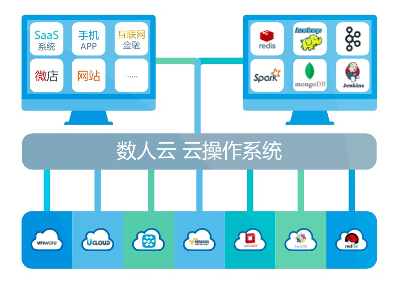
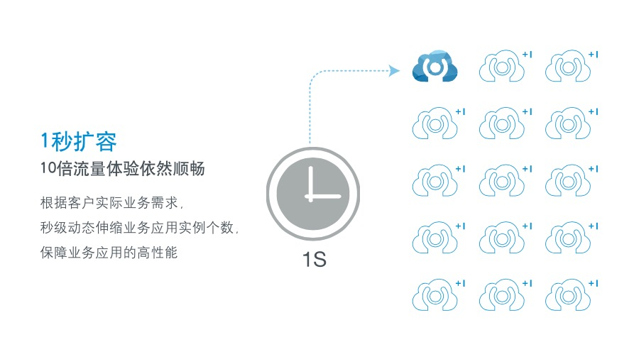
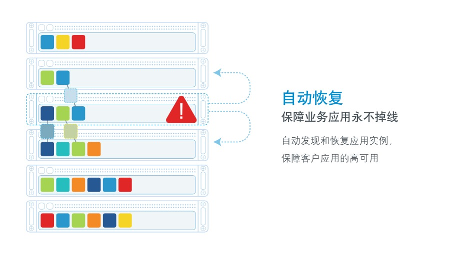
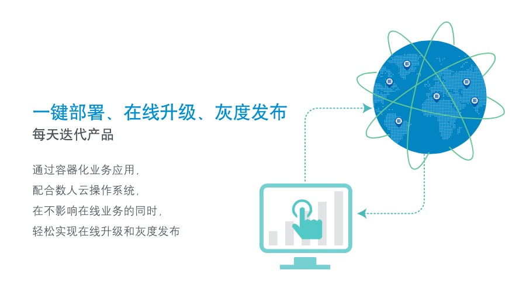
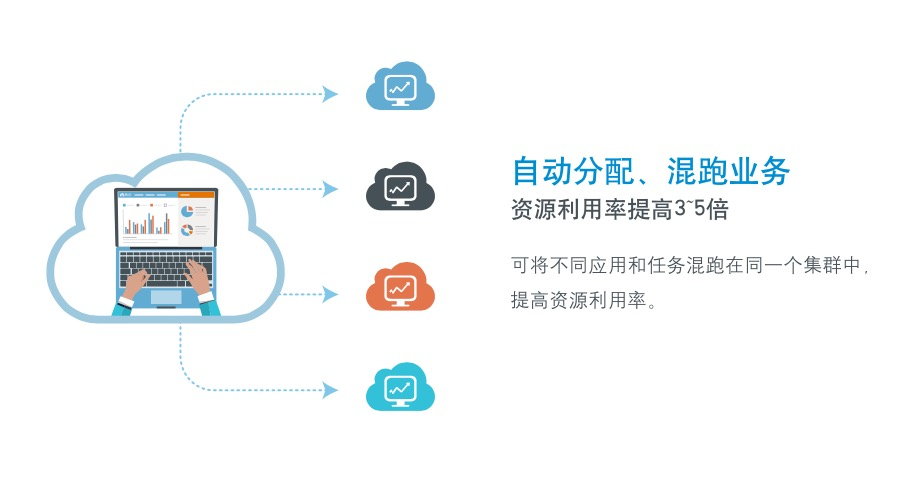

# 数人云 云操作系统

“数人云”云操作系统，是一款部署在公有云或者私有云（IDC）之上的应用运维软件，旨在帮助用户在云端快速建立并稳定运维一个高性能生产环境。
通过数人云，用户可以快速部署海量的Docker应用，在保障高可用的同时实现秒级的快速伸缩能力。快速搭建并运维Spark、Hadoop MR、Kafka等等集群化应用，并且保证服务资源和数据均为用户私有。

#### 像管理单机软件一样管理云端应用
#### 像使用一台电脑一样使用整个集群

