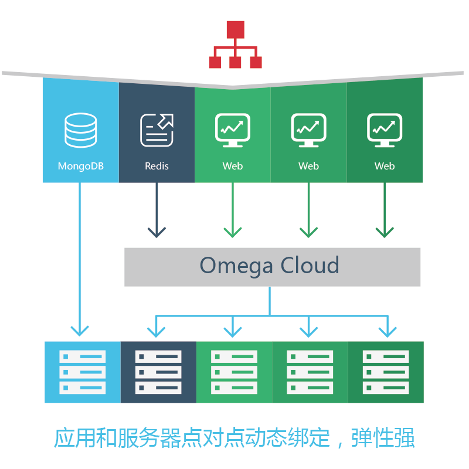

# Omega Cloud 云操作系统

Omega Cloud 是一款是以分布式技术为基础的云操作系统。其采用了 Mesos 分布式计算框架，Docker 容器等最新技术，将底层资源进行统一管理、动态调度。为用户实现了一个高性能，高可靠，易使用的分布式云生产环境。

通过使用 Omega Cloud 云操作系统，用户能够像用一台服务器一样使用整个集群，并可以通过 web 界面就完成绝大部分的运维管理工作。与虚拟机技术提供的“硬件虚拟化”相类比，Omega Cloud 进行了“操作系统虚拟化”。这样 Omega Cloud 用户就可以专注在其自身业务的开发和运营，而无需花费大量精力进行基础环境运维。

### 弹性的云生产环境——支持业务无限增长

Omega Cloud 操作系统可以管理任意规模的应用。Omega Cloud 是通过将应用层与资源层解耦，动态调度和分配资源来实现整个集群的弹性缩放功能。不管是10还是10000台服务器，Omega Cloud 都可以在整个集群轻松实现弹性扩展。从而轻松应对业务的爆发式增长。

####应用层弹性

* 将应用部署在负载均衡器后，根据实时的需求变化，自动调整应用实例数量。
* 一键部署应用实例到整个集群。只需要几分钟或几秒钟。

####资源层弹性

当你的业务增长或有新业务要上线时，我们可以很容易的将新的资源添加到整个集群资源池中。

* 扩展计算资源：将 Omega Cloud 节点安装到新的服务器或虚拟机，并连上网络。Omega Cloud 会自动发现这些新的资源，并将其添加到整个集群中。
* 自动弹性缩放：Omega Cloud 可以通过云服务商的 API 接口按需自动扩展或收缩集群规模，以应对爆发式增长。

### “高可用” 服务器会宕机，但业务不会掉线

当您开启高可用服务后，Omega Cloud 会自动为宕机服务器上运行的节点重新分配资源，保障业务不掉线，高可靠运行。这也就意味着您不用再为一两台服务器的宕机，而经历一个不眠之夜。

### 提升资源利用率

传统的数据中心或云的资源利用率只有个位数。Omega Cloud 可以将不同应用自动混合部署到整个集群，不受单个服务器边界限制，明显提升了资源利用率。根据大规模使用分布式操作系统的用户提供的数据（例如腾讯和谷歌），一般说来整体利用率可以提升到60-90%。

### 易管理

Omega Cloud 拥有极高的易用性。在此之前，管理分布式应用，或监控数十台，上千台服务器的运行情况是一件很困难的事情。Omega Cloud 强大的命令行工具和控制面板，让这一切都变得容易起来。
最重要的是集群扩展变地十分容易，只需要简单地添加底层服务器资源即可。集群的管理复杂度不会随着规模扩展而明显增加。

### “易部署” 一次开发，到处运行

Omega Cloud 使用 Docker 容器技术封装应用。通过将应用，依赖关系，配置信息打包在一起，Docker 封装的应用拥有了极高的可移植性。这样就使得用户不需要重写代码，就可以在公有云，私有云或混合云上部署和管理应用。

此外，无论集群大小，对于您而言其逻辑上是一台机器，应用的部署、运行和监控如同在单机进行。可以方便开发者进行持续交付，推进产品迅速迭代优化。使用 Omega Cloud 后，应用迭代更新的速度可以提高7倍以上。

