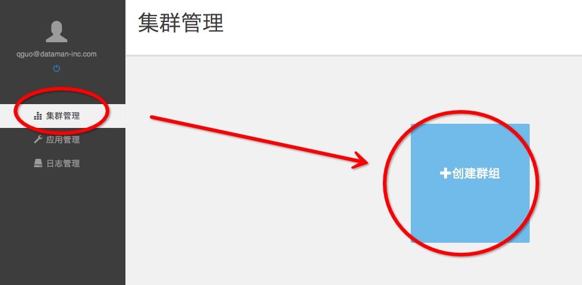
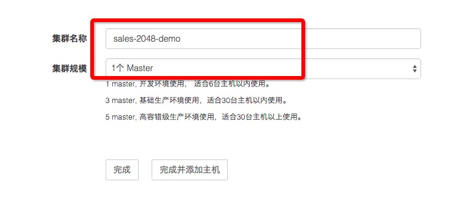
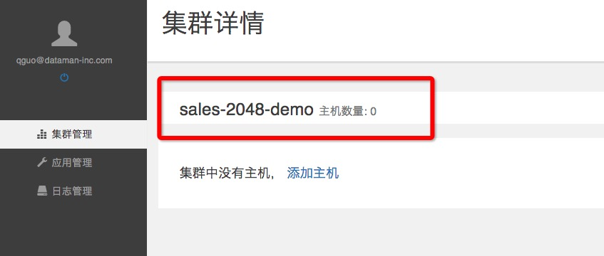
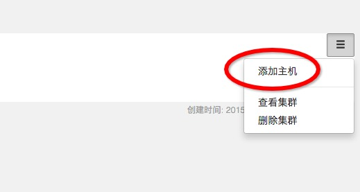
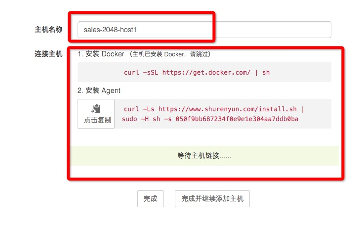
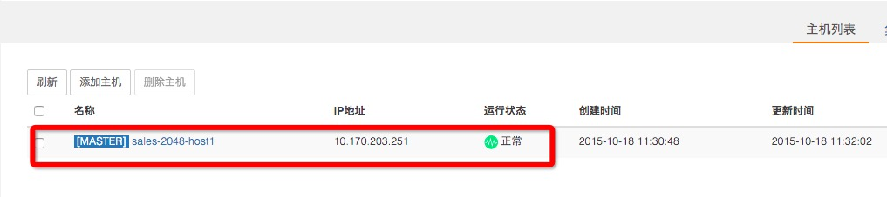
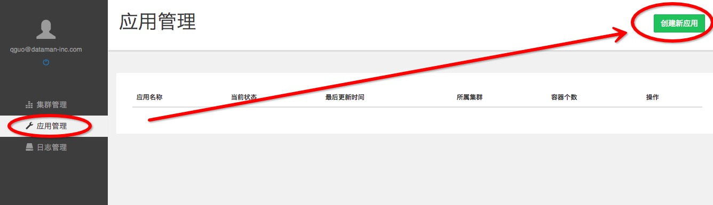
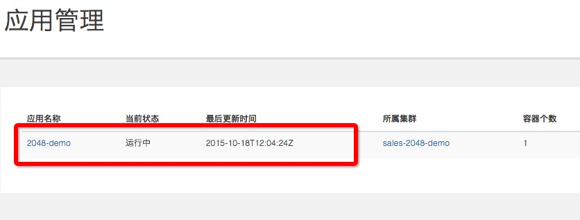

# 用数人云三步发布2048游戏应用
## 目录
### [第一步建立集群](#step1)
### [第二步发布应用](#step2)
### [第三步服务发现](#step3)

<h2 id="step1">第一步建立集群（应用发布环境）</h2>
### 1.1 注册&登录数人云
访问 [www.shurenyun.com](http://www.shurenyun.com) 注册并登录系统。  
备注：数人云目前是内测期，如您需要邀请码，请填写免费试用表单申请。  
[免费试用>>](http://form.mikecrm.com/f.php?t=CgBTTT)

### 1.2 准备主机
需要准备至少一台主机，主机可以是可以连接互联网的物理主机，也可以是阿里云、Ucloud、AWS、Azure、首都在线、华为云等公有云上购买的任意一台云主机。

### 1.3 建立集群

1.3.1 登录账户后，在集群管理中，点击创建群组。（如图所示）

1.3.2 填写集群名称（sales-2048-demo），选择 1 Master集群，点击完成。

备注：本例是demo，所以选择 1 Master 集群即可。

集群已经建立，如下图所示：

### 1.4 添加主机

1.4.1 添加主机，如图点击右上角下拉菜单，选择添加主机。

1.4.2 填写主机名称，并在主机上根据"连接主机"的提示进行操作。

（1）安装Docker

	curl -sSL https://get.docker.com/ | sh

（2）安装 Agent

	curl -Ls https://www.shurenyun.com/install.sh | sudo -H sh -s 050f9bb687234f0e9e1e304aa7ddb0ba

执行以上两步后，点击"完成"即成功添加主机。

提示：向同一集群添加的主机应存在于同一网段内，暂不支持跨公网的主机组建集群。

### 1.5 确认集群环境正常

主机添加完成后，检查主机运行是否正常，如图所示：

<h2 id="step2">第二步发布应用</h2>

### 2.1 找到或制作2048游戏镜像

我们选择Docker官方镜像库的2048游戏镜像，镜像地址是：

hub.docker.com/alexwhen/docker-2048

### 2.2 新建2048游戏应用

2.2.1 选择"应用管理"中的"创建应用"，如图所示：

2.2.2 创建应用

填写应用名称:2048-demo

添加应用镜像地址：alexwhen/docker-2048

选择容器规格和集群

填写镜像版本，一般为：latest

如图所示：

### 2.3 确认应用正常运行

回到应有管理中，即可看到应用已正常运行。

<h2 id="step3">第三步服务发现，let's play !</h3>
