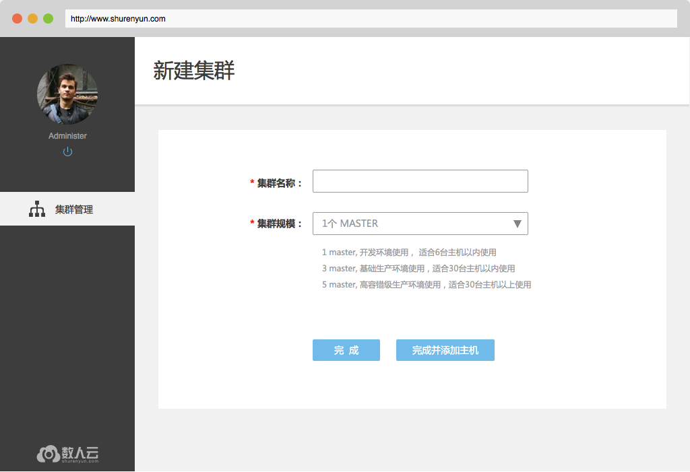
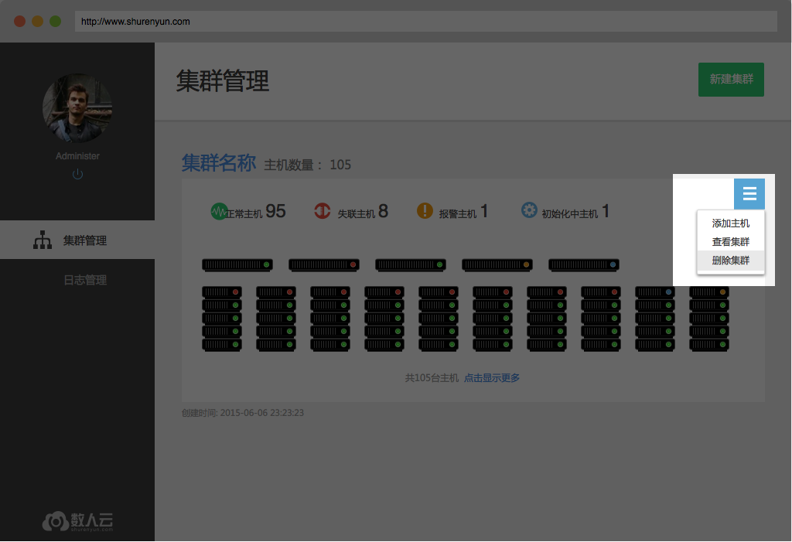
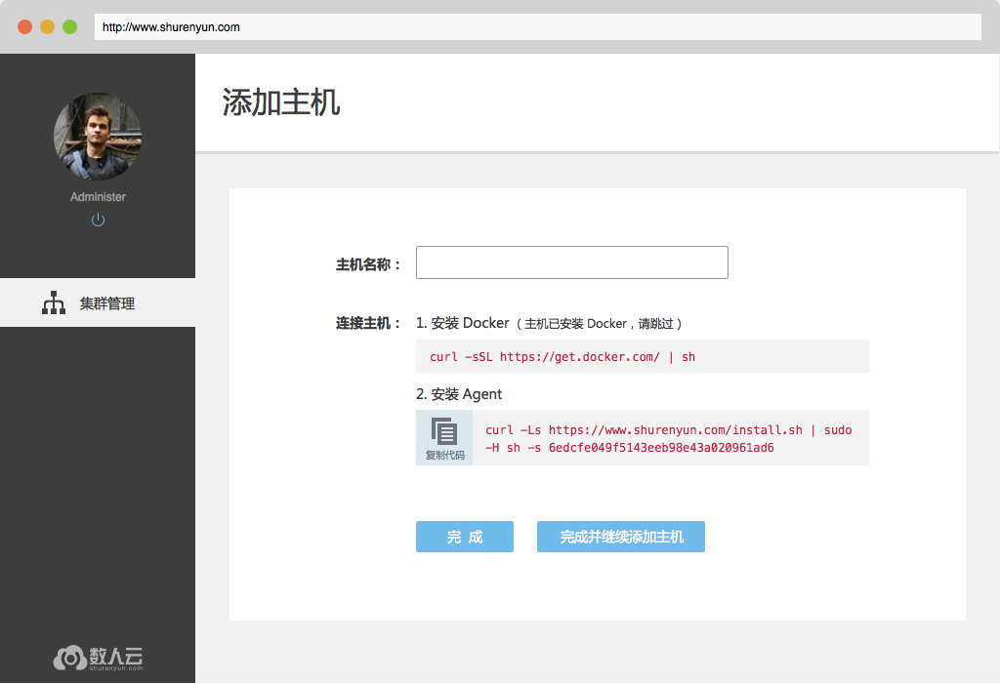
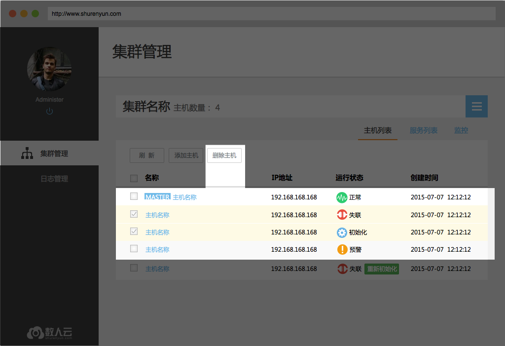
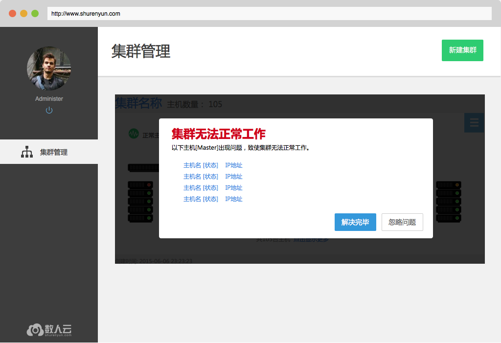
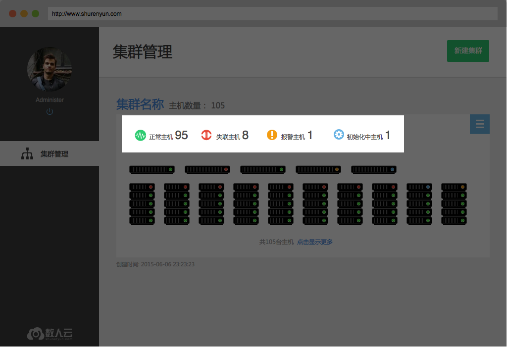
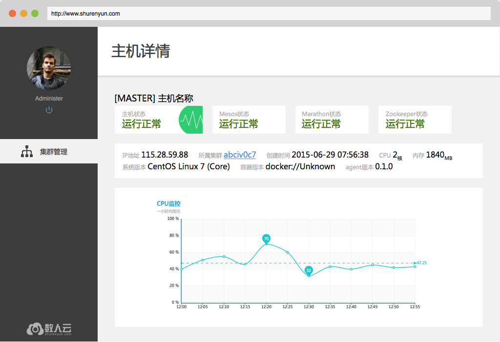
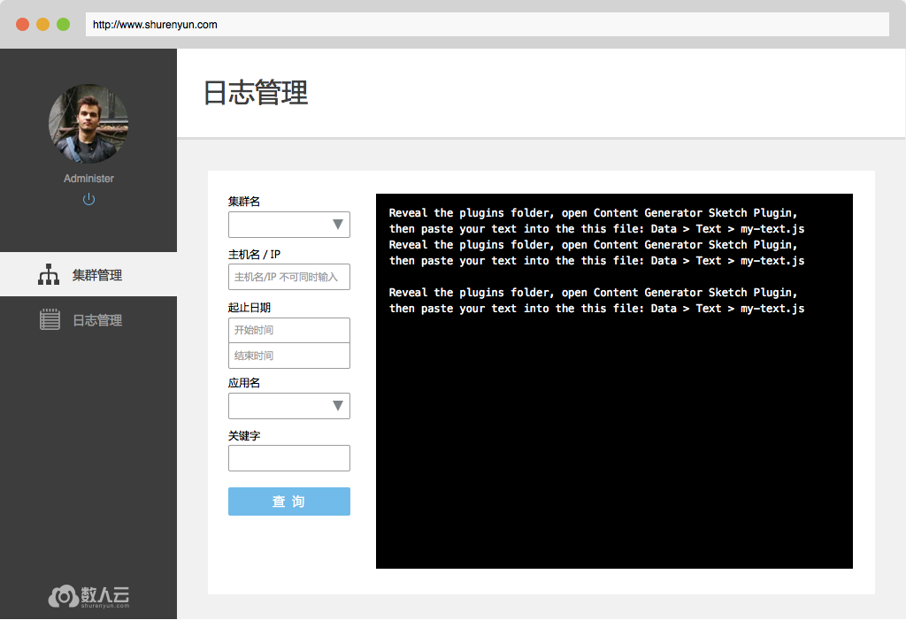
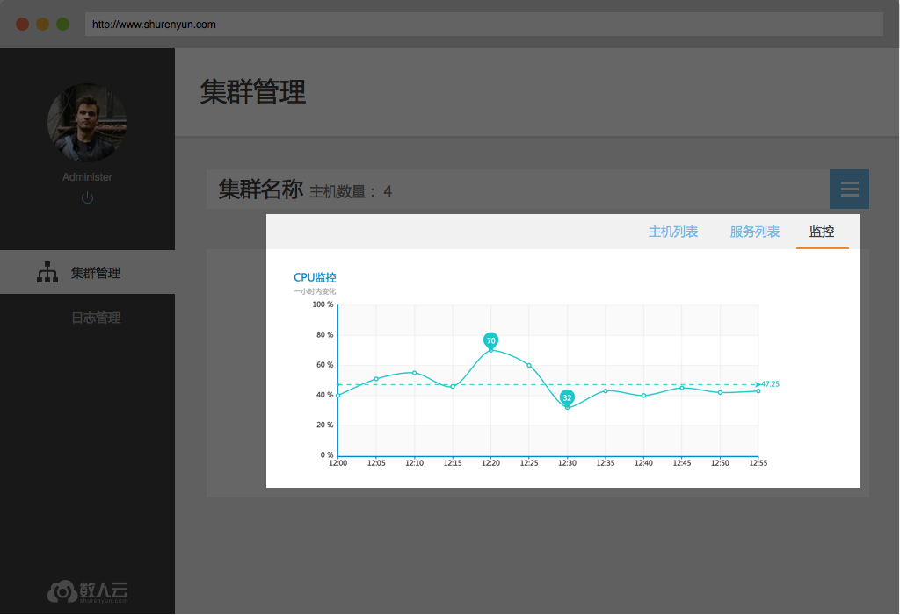
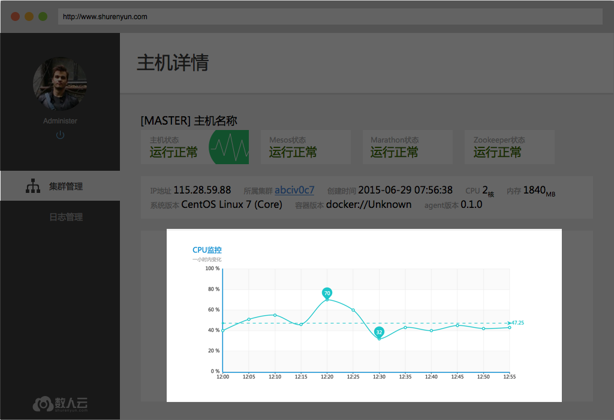

##  概述

### 1、数人云是什么 

数人云是一款可一键部署在任意公有云或私有云上的云管理软件。其采用了mesos分布式计算框架、docker容器等最新技术，并根据长期的生产运维经验进行了深度集成开发，能为企业级客户带来全新的云使用体验。    

### 2、数人云能做什么 

数人云能够帮助用户轻松管理集群，使得集群易使用，无论集群大小，对于您而言其逻辑上是一台机器，应用的部署、运行和监控如同在单机进行，并且通过调度管理功能极大提高资源利用率，从而提高整体集群的性能。同时，用户能够使用简单易用的web界面，获得集群的监控、状态信息，像使用一台机器那样向集群部署应用，并监控应用的运行状况。方便开发者进行持续集成，从而推进产品的迭代优化，实现持续交付。    
   
## 集群管理

### 1、创建/删除新集群 

**1.1创建集群**     
只需输入集群名称就可以建立一个新的集群，当然，还需要用户进一步添加主机（详见2、添加/删除主机）才能构成真正可以工作的集群。创建集群时可以根据集群规模选择在集群中安装 1、3 或 5 个master。当集群中主机数量 > 10时建议选择3master，当主机数 >30 时5master更适合。   
    

**1.2 删除集群 **    
用户在集群管理、集群详情页面都可以删除集群，确认删除后，数人云平台会停止集群上运行的所有应用、组件，但应用产生的业务数据依然保留在原主机上。   
 

### 2、添加/删除主机

**2.1添加主机**   
用户在集群管理页、集群详情页都可以找到“添加主机”。向集群添加主机，首先需要在主机上安装Docker，再安装数人云的主机监控程序。添加成功后，用户可以点击完成转向集群详情页，就可以在主机列表中看到这台主机，也可以选择继续添加其他主机，进行相同的操作即可。提醒：向同一集群添加的主机应存在于同一网段内，暂不支持跨公网的主机组建集群。

**2.2删除主机**   
即将主机从该集群中删除，在集群详情页选择想要删除的主机，点击删除主机按钮并确认。删除主机并不删除主机上的应用数据，但会停止主机监控程序，即agent，从而无法通过数人云平台的集群管理访问该主机。     
    

### 3、查看集群 

**3.1 集群状态**     
集群正常工作时，用户可以在集群管理页看到集群中4种主机状态下各有多少台主机，以及集群中每一个master的运行状态。     
 

当集群中超过半数的master为非正常状态时，集群也将被标识为异常状态，如下图所示。     
     

**3.2 集群中的主机**   
集群管理页和集群详情页（可由查看集群进入）都能看到集群中的主机，每个主机的图形、文字符号，也都可以转向主机的详情页面（详见4、查看主机）。     

### 4、查看主机

4.1 主机状态      
主机整体的运行状态，在主机列表中均有标识，无论是集群管理页的图形化主机列表还是集群详情页的表格、文字主机列表。主机有4种运行状态：    
-正常，主机监控程序及数人云平台管理组件都正常运行，平台可以向主机分发应用、下发任务；    
-异常，主机监控程序可以与数人云平台通信，但是管理组件已无法正常接收、执行平台下发的任务；    
-失联，主机监控程序与数人云平台的通信中断；    
-初始化中，主机监控程序正常运行，正在初始化数人云平台的管理组件。 

## 日志查询

用户可以查询历史日志，通过页面上给定的条件，见下图。其中，选择的集群会影响应用列表呈现的内容。   

## 监控

### 1、 集群监控

用户能在集群详情页看到集群的监控信息，包括CPU、内存和磁盘的整体使用情况。

### 2、 主机监控

用户能在主机详情页看到主机的监控信息，包括CPU、内存和磁盘的整体使用情况。

### 3、 应用监控

用户能在应用详情页看到监控信息，包括该应用使用的CPU、内存和磁盘，这个应用所在的集群上所有应用对资源的使用，从而，用户也能够看到集群中剩余的可用资源。   
[应用详情页—监控部分]

## 报告问题

用户可以联系客服报告使用数人云遇到的任何问题，按照页面显示输入问题描述，尽可能详细。数人云的客服会及时处理，并在必要的时候联络用户以获取更多信息制定并实施解决方案。   
[工单入口的图示]
